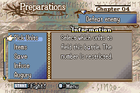

# Bonus EXP

  

---

## 📑 Index
- [Introduction](#introduction)
- [How-To-Use](#How-To-Use)
- [Code Locations](#code-locations)
- [TODO](#todo)
- [Limitations & Bugs](#limitations--bugs)

---

## 🧩 Introduction

``gpKernelDesignerConfig->prep_menu_bexp``

This feature introduces a prep menu implementation of FE9/FE10's bonus experience feature. Leveling up in the menu is supported, as is the triple stat ups from Radiant Dawn (though disabled by default)

The aim is to ensure:

- Units can be displayed in a list
- Seleted units can have partial BEXP applied or enough for a full level up
- Units can then level up if enough experience is applied
- A multiplier is present where stronger units require more BEXP to level up, to discourage funnelling it all into one unit

---

## 🛠️ How To Use

- Inside [`designer-config.c`](../../Data/DesignerConfig/designer-config.c) set the `.prep_menu_bexp` option to true.
- Use the ASMC ``ASMC(GrantBEXP)`` in the end event for a chapter to trigger the popup display for granting BEXP
- Navigate to the prep menu and select "Bonus EXP"
- Select a unit in the list and apply an amount of BEXP to them (in increments of 5)

---

## 🗂️ Code Locations

| Feature | Location | Description |
|--------|----------|-------------|
| **BEXP table** | `gBexpGainConstants` in [`BEXP.c`](../../Kernel/Wizardry/Core/SkillSys/PrepSkill/Source/CustomMenuOptions/BEXP.c) | Holds the table for awarded BEXP amounts |
| **BEXP popup** | `BEXPPopup` in [`BEXP.c`](../../Kernel/Wizardry/Core/SkillSys/PrepSkill/Source/CustomMenuOptions/BEXP.c) | The proc for the popup |
| **BEXP sprites** | `DrawUnitSprites_BEXP` in [`BEXP.c`](../../Kernel/Wizardry/Core/SkillSys/PrepSkill/Source/CustomMenuOptions/BEXP.c) | Handles the continous drawing of sprites every frame |
| **Setup graphics** | `PrepInitGfx_BEXP` in [`BEXP.c`](../../Kernel/Wizardry/Core/SkillSys/PrepSkill/Source/CustomMenuOptions/BEXP.c) | Setup graphics at the init stage |
| **Level up proc** | `CallLevelUpProc` in [`BEXP.c`](../../Kernel/Wizardry/Core/SkillSys/PrepSkill/Source/CustomMenuOptions/BEXP.c) | Starts the level up sequence |
| **Award BEXP** | `GrantBEXP` in [`BEXP.c`](../../Kernel/Wizardry/Core/SkillSys/PrepSkill/Source/CustomMenuOptions/BEXP.c) | The proc for granting BEXP at the end of a given map |
| **Frame loop** | `PrepLoop_MainKeyHandler_BEXP` in [BEXP.c`](../../Kernel/Wizardry/Core/SkillSys/PrepSkill/Source/CustomMenuOptions/BEXP.c) | The loop that runs every frame check for button states etc |
| **Parent proc for BEXP** | `ProcScr_PrepItemListScreen_BEXP` in [BEXP.c`](../../Kernel/Wizardry/Core/SkillSys/PrepSkill/Source/CustomMenuOptions/BEXP.c) | The proc that handles the entire BEXP menu experience |

---

## 📝 TODO

- Move the location of the level up sprite to the center of the screen

---

## 🐛 Limitations & Bugs

Please report issues in the repository’s **Issues** tab.

- There's a slight visual glitch for a split second when displaying a unit's stat screen in the bexp menu and then exiting it. But it's minor and automatically corrected.

---