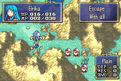

# Goal - Escape

  

---

## 📑 Index
- [Introduction](#introduction)
- [How-To-Use](#how-to-use)
- [Plan](#plan)
- [Code Locations](#code-locations)
- [TODO](#todo)
- [Limitations & Bugs](#limitations--bugs)

---

## 🧩 Introduction

``gpKernelDesignerConfig->goal_escape``

This feature adds an escape-style chapter objective. Instead of winning by routing enemies or surviving until a timer expires, the player must move units onto a valid escape tile and remove them from the map one by one.

The player-facing goal is simple: get units to the escape point, keep track of who has left, and finish the chapter once everyone who must escape is gone.

---

## 🛠️ How To Use

Inside [`designer-config.c`](../../../Data/DesignerConfig/designer-config.c) set `.goal_escape = true`.

Inside each chapter definition, set `.goalWindowDataType = GOAL_TYPE_ESCAPE` for any chapter that should display and use the escape objective.

For the current setup, escape tiles are checked in [`Escape.c`](../../../Kernel/Wizardry/Misc/Goals/Escape.c) and chapter 0 is wired to use the escape ending flow. The current implementation uses a fixed escape coordinate of `3, 3` for the configured chapters.

To show the escape tiles visually, add a trap entry in that chapter's trap header at the same coordinates as the escape tile. Chapters that use traps keep them in `events/traps.h` (see [`Chapters/01/events/traps.h`](../../../Data/CustomCampaign/Chapters/01/events/traps.h)). Keep trap coordinates aligned with the values returned by `IsEscapeTile`.

To add a new escape chapter, update the chapter’s goal type, make sure the chapter is included in `HasEscapeObjective` and `IsEscapeTile`, and provide the appropriate ending event symbol for that chapter.

---

## 🛠️ Plan

- Show the escape objective only when `goal_escape` is enabled and the chapter uses `GOAL_TYPE_ESCAPE`
- Detect when the active unit ends its action on a valid escape tile
- Display a short escape quote, then remove that unit from the map without deleting it from the army roster
- Recount the remaining deployed player units after each escape
- Trigger the chapter ending event once the remaining deployed player unit count reaches zero
- Keep the ending event selection chapter-specific so each map can finish with its own scene

---

## 🗂️ Code Locations

| Feature | Location | Description |
|--------|----------|-------------|
| **Enable escape objective** | `.goal_escape` in [`designer-config.c`](../../../Data/DesignerConfig/designer-config.c) | Master config flag for the escape system |
| **Chapter goal type** | `.goalWindowDataType = GOAL_TYPE_ESCAPE` in [`chapter.c`](../../../Data/CustomCampaign/Chapters/00/events/chapter.c) | Marks a chapter as using the escape objective |
| **Goal display handling** | `GOAL_TYPE_ESCAPE` in [`GoalDisplay.c`](../../../Kernel/Wizardry/Misc/Goals/GoalDisplay.c) | Displays the escape text in the goal window |
| **Escape entry point** | `PostAction_Escape` in [`Escape.c`](../../../Kernel/Wizardry/Misc/Goals/Escape.c) | Runs after a unit finishes an action and starts the escape flow |
| **Escape tile check** | `IsEscapeTile` in [`Escape.c`](../../../Kernel/Wizardry/Misc/Goals/Escape.c) | Verifies whether the current chapter tile is a valid escape tile |
| **Remove escaped unit** | `RemoveActiveUnitASMC` in [`Escape.c`](../../../Kernel/Wizardry/Misc/Goals/Escape.c) | Removes the active unit from the map while keeping roster data intact |
| **Count remaining players** | `CheckPlayersRemainingASMC` in [`Escape.c`](../../../Kernel/Wizardry/Misc/Goals/Escape.c) | Recounts deployed blue units after each escape |
| **Choose ending event** | `CallEscapeEndingEventASMC` in [`Escape.c`](../../../Kernel/Wizardry/Misc/Goals/Escape.c) | Selects the chapter-specific ending event based on the current chapter |
| **Post-action hook** | `PostAction_Escape` in [`data.event`](../../../Kernel/Wizardry/Common/PostActionHook/data.event) | Registers the escape flow with the post-action hook list |

---

## 📝 TODO

- Replace the fixed `3, 3` escape tile with per-chapter coordinates
- Expand the chapter switch so every escape chapter has its own ending event mapping
- Add more escape chapters only after their ending events and tiles are defined

---

## 🐛 Limitations & Bugs

Please report issues in the repository’s **Issues** tab.

- Escape tiles currently use a shared hardcoded coordinate instead of chapter-specific data.
- The current flow depends on post-action processing, so edge cases around non-wait actions should be tested carefully.
- Chapters without a matching ending event will not complete correctly until their event symbol is added.
