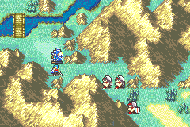

# Goal - Timer

  

---

## 📑 Index
- [Introduction](#introduction)
- [How-To-Use](#How-To-Use)
- [Plan](#plan)
- [Code Locations](#code-locations)
- [TODO](#todo)
- [Limitations & Bugs](#limitations--bugs)

---

## 🧩 Introduction

``gpKernelDesignerConfig->goal_timer``

This feature adds a real-time ticking clock as a lose condition. You still have to complete the map's original objective (seize, defeat the boss, and so on) before the clock hits zero, or you lose. The map goal HUD is taken over by the countdown; open **Status** on the map to read the chapter objective.

In the words of Huichelaar - "Timed stages in FE? That's so evil lmao"

---

## 🛠️ How To Use

Inside [`designer-config.c`](../../../Data/DesignerConfig/designer-config.c) set the `.goal_timer` option to true.

Inside [`Timer.c`](../../../include/jester_headers/custom-structs.h) there is a struct called `chapter_timers`. It is comprised of two elements; the `chapter index`
and the `time in seconds`. Set each chapter to the timer value you want. If it is set to 0, then the timer won't appear. If it is greater than 0, the map HUD
shows the countdown instead of the usual goal window (so you don't have to edit chapter goal data). The **Status** menu still shows the chapter's original objective,
and that objective is still how you win. Hitting 0 is game over.

---

## 🛠️ Plan

- Add a configurable timer that is set in an ASMC of the chapter setup events
- Have that timer countdown when not in battle animations
- Produce a game over screen when it hits 0
- Suspend/Resume current time
- Add/remove time based on whatever parameters you wish in the variable ``gChapterTimerSeconds``
- Play events when certain times are reached (time currently doesn't pause of them, will need to locate the event engine proc)

---

## 🗂️ Code Locations

| Feature | Location | Description |
|--------|----------|-------------|
| **Global variables** | `gChapterTimerSeconds` in [`Timer.c`](../../../include/jester_headers/custom-structs.h) | Holds the current and initial time respectively |
| **Initialize timer** | `StartChapterTimer` in [`Timer.c`](../../../Kernel/Wizardry/Timer/Timer.c) | Takes care of setting the global variables and starting the timer proc |
| **New goal type** | `GOAL_TYPE_TIMER` in `GoalDisplay_Init` [`Timer.c`](../../../Kernel/Wizardry/Timer/Timer.c) | Handles the display initialization of the new goal |
| **Draw countdown** | `DrawTimeHMS` in [`Timer.c`](../../..//Wizardry/Timer/Timer.c) | Handles the calculations to update the digits |
| **Update timer** | Hook into `GoalDisplay_Loop_Display` in [`Timer.c`](../../../Kernel/Wizardry/Timer/Timer.c) | Call `DrawTimeHMS` here to display the new time every 60 frames |

---

## 📝 TODO

- Pause time on events

---

## 🐛 Limitations & Bugs

Please report issues in the repository’s **Issues** tab.

- Some graphics on resume have been known to slightly glitch intermittently but it's quickly resolved when the map is viewed again

---
