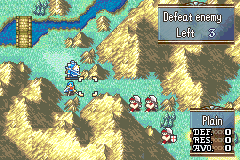

# Character Biographies

<p align="center">
  
</p>

---

## 📑 Index
- [Introduction](#introduction)
- [How-To-Use](#how-to-use)
- [Code Locations](#code-locations)
- [TODO](#todo)
- [Limitations & Bugs](#limitations--bugs)

---

## 🧩 Introduction

``MapMenu_BiographyCommand``  
``ProcScr_MenuMap_BIOGRAPHY``

This feature adds a **Character Biographies** command to the map menu.

The aim is to ensure:

- A scrollable list of playable character biographies
- Per-character music selection
- Multi-page CG-style biography presentation (4 entries per character)

Each character biography consists of:

- Character ID
- Subtitle string
- Song ID (or random fallback)
- Four `(textId, backgroundId)` pairs

---

## 🛠️ How To Use

- Add entries inside the ``gCharacterBiographies`` table:
  - `characterId`
  - `subtitle`
  - `songId`
  - Four biography entries `{ textId, backgroundId }`
- Ensure all `MSG_*` text IDs exist in your text buildfile.
- Ensure all background IDs correspond to valid CG/background resources.
- The command is triggered via:

  ```
  MapMenu_BiographyCommand
  ```

- The event script `EventScr_CharacterBiographies` automatically:
  - Prevents skipping
  - Fades in
  - Displays 4 CG/text entries sequentially

The visible list count is controlled by:

```
#define BASE_VISIBLE_COUNT 5
```

---

## 🗂️ Code Locations

All functions can be found in [`CharacterBiographies.c`](../../Data/MapMenus/CharacterBiographies.c)

| Feature | Location | Description |
|----------|----------|-------------|
| **Biography Table** | `gCharacterBiographies` | Stores all character data, subtitles, music, and entry pages |
| **List Count Function** | `NumberOfCharacterBiographies` | Returns total biography entries |
| **Menu Draw Function** | `DrawBaseConversations` | Draws visible character names and subtitles |
| **Initialization** | `Biography_Init` | Sets up backgrounds, UI frame, scroll bar, cursor, and music |
| **Input Handler** | `MainKeyHandler_Biography` | Handles A/B/Up/Down input and scrolling |
| **Event Script** | `EventScr_CharacterBiographies` | Controls multi-page CG biography flow |
| **Event Caller** | `CallBiographyEvent` | Starts selected character’s biography event |
| **Prep Cleanup** | `DisablePrepScreenDisplay` | Clears UI before entering event |
| **Map Restore** | `Biography_RestoreMapGraphics` | Restores map graphics and interface |
| **Proc Definition** | `ProcScr_MenuMap_BIOGRAPHY` | Full lifecycle controller for biography screen |
| **Menu Command Hook** | `MapMenu_BiographyCommand` | Entry point from map menu |

---

## 🧠 System Overview

### 📜 Biography Data Structure

Each entry in:

```
gCharacterBiographies[]
```

Contains:

```
{
    characterId,
    subtitle,
    songId,
    {
        { textId, backgroundId },
        { textId, backgroundId },
        { textId, backgroundId },
        { textId, backgroundId }
    }
}
```

This allows:

- 4 CG pages per character
- Automatic sequencing through `SetIndexes`
- Event-driven background and text loading

---

### 🎮 Input Behavior

- **A Button**
  - Triggers biography event
  - Plays selected song (or random if 0)

- **B Button**
  - Exits menu
  - Restores map graphics

- **D-Pad Up/Down**
  - Scrolls character list
  - Updates:
    - Cursor position
    - Scrollbar
    - Visible entries

---

### 🎵 Music Handling

Inside `CallBiographyEvent`:

- If `songId == 0`
  - Plays a random track
- Otherwise
  - Plays the assigned BGM

---

### 🧾 Event Flow

The event script:

```
EventScr_CharacterBiographies
```

- Disables skipping
- Fades from black
- Calls `SetIndexes` before each page
- Displays 4 CG biography entries
- Ends cleanly
- Returns to biography menu

---

## 📝 TODO

- Support conditional biography unlocks
- Add portrait preview on selection
- Add support for locked biographies
- Add page indicators (e.g. 1/4, 2/4)

---

## 🐛 Limitations & Bugs

Please report issues in the repository’s **Issues** tab.

---