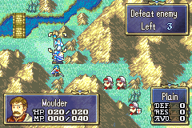

# Arbalest Staff

  

---

## Index
- [Introduction](#introduction)
- [Plan](#plan)
- [Code Locations](#code-locations)
- [TODO](#todo)
- [Limitations & Bugs](#limitations--bugs)

## Introduction

The Arbalest Staff creates a ballista at the selected tile and then runs the normal staff-use presentation flow.

From a player perspective, the item behaves like a targeted utility staff: the user chooses a valid mine/ballista tile, the staff animation plays, the map updates to place the new ballista, and the staff EXP bar is shown afterward if the use grants EXP.

The main design goal is to keep the item inside the existing IER-style staff pipeline instead of inventing a separate action system. That keeps target selection, battle-state updates, and EXP handling consistent with the rest of the custom item set.

## Plan

Arbalest follows a simple staged flow:

| Stage | Behavior |
|------|----------|
| Target selection | The unit is restricted to valid target tiles through the mine target-list helper. |
| Animation | A light-rune style animation plays at the selected coordinates. |
| Effect | The item is initialized as a staff use, then a regular ballista is spawned on the target tile. |
| Map refresh | Entity maps, map rendering, and unit sprites are refreshed so the new ballista appears immediately. |
| EXP display | If the use awards EXP, the map battle EXP bar is started after the effect finishes. |

Implementation-wise, the staff uses the existing `ProcScr_ArbalestStaff` proc chain to serialize those steps in order:

1. Start the target animation.
2. Wait for the animation proc to finish.
3. Apply the item effect and add the ballista.
4. Wait for the battle animation lock to clear.
5. Start the EXP bar if the use grants EXP.
6. Wait for the EXP bar proc to finish.

## Code Locations

| Feature | Location | Description |
|--------|----------|-------------|
| Target selection | `IER_Usability_Arbalest` in [`Data/CustomItems/ArbalestStaff/ArbalestStaff.c`](../Data/CustomItems/ArbalestStaff/ArbalestStaff.c) | Rejects cantoing units and gates usability through the mine target-list helper. |
| Staff setup and target commit | `IER_Effect_Arbalest` and `Arbalest_OnSelectTarget` in [`Data/CustomItems/ArbalestStaff/ArbalestStaff.c`](../Data/CustomItems/ArbalestStaff/ArbalestStaff.c) | Stores the chosen tile in `gActionData`, sets the staff use action, and clears the selection UI. |
| Animation step | `ArbalestStaff_Anim` in [`Data/CustomItems/ArbalestStaff/ArbalestStaff.c`](../Data/CustomItems/ArbalestStaff/ArbalestStaff.c) | Starts the light-rune animation at the chosen target tile. |
| Ballista placement | `ArbalestStaff_Exec` in [`Data/CustomItems/ArbalestStaff/ArbalestStaff.c`](../Data/CustomItems/ArbalestStaff/ArbalestStaff.c) | Calls `BattleInitItemEffect`, adds the regular ballista, refreshes the map, and applies the item effect. |
| Proc sequencing | `ProcScr_ArbalestStaff` in [`Data/CustomItems/ArbalestStaff/ArbalestStaff.c`](../Data/CustomItems/ArbalestStaff/ArbalestStaff.c) | Orchestrates animation, effect, and EXP-bar sequencing. |
| EXP bar startup | `ArbalestStaff_ShowExpBar` in [`Data/CustomItems/ArbalestStaff/ArbalestStaff.c`](../Data/CustomItems/ArbalestStaff/ArbalestStaff.c) | Initializes map battle animation state and starts `ProcScr_MapAnimExpBar` when EXP is earned. |
| Event binding | `ArbalestStaff.lyn.event` in [`Data/CustomItems/ArbalestStaff/ArbalestStaff.lyn.event`](../Data/CustomItems/ArbalestStaff/ArbalestStaff.lyn.event) | Exports the three C entry points used by the item hook. |

## TODO

## Limitations & Bugs

- The current effect always spawns `ITEM_BALLISTA_REGULAR`; there is no item-data-driven ballista type selection yet.
- If the item is expanded to support more target types, the target-list helper will need to be updated in tandem.
