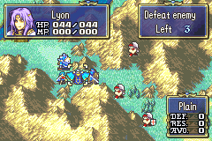

# Aum Staff

  

---

## 📑 Index
- [Introduction](#introduction)
- [Plan](#plan)
- [Code Locations](#code-locations)
- [TODO](#todo)
- [Limitations & Bugs](#limitations--bugs)

---

## 🧩 Introduction

The **Aum Staff** revives the most recently killed player unit and places that unit on a chosen adjacent tile.

From the player’s perspective, the staff is intentionally narrow and predictable:

- It only becomes usable when a valid dead blue unit exists.
- It only allows adjacent landing tiles.
- It plays the revive animation before the unit reappears.
- It shows a popup that includes the revived unit’s name.

The design goal is to make Aum feel like a real staff action instead of a one-off event script. It uses the item revamp path, dead-unit tracking, save persistence, and popup rework systems already present in the project.

---

## 🛠️ Plan

Aum follows a short revive pipeline:

| Step | Player Result | Implementation Responsibility |
|------|---------------|-------------------------------|
| 1 | The staff appears usable only when a valid dead player unit exists | Read the dead-unit history stack and verify the stored unit is still valid |
| 2 | The cursor can only choose adjacent tiles | Build the target list from the four tiles around the active unit and reject illegal placements |
| 3 | The light rune effect plays first | Start the animation in a blocking proc and wait for `ProcScr_LightRuneAnim` to finish |
| 4 | The dead unit returns on the chosen tile | Clear the dead flags, move the unit, set HP to 1, and remove the unit from dead history |
| 5 | A popup appears after the revive | Use the popup rework system to show the revived unit’s name and the revive text |

The implementation deliberately avoids a full revive menu. Aum always revives the last tracked dead player unit, which keeps the item simple and makes the target selection easy to reason about.

---

## 🗂️ Code Locations

| Feature | Location | Description |
|--------|----------|-------------|
| **Aum staff behavior** | `IER_Usability_Aum`, `IER_Effect_Aum`, `IER_Action_Aum` in [`AumStaff.c`](../../Data/CustomItems/AumStaff/AumStaff.c) | Main revive flow, target selection handoff, animation wait, and revive execution |
| **Adjacent tile target list** | `MakeTargetListForAum` and `AumTryAddTarget` in [`AumStaff.c`](../../Data/CustomItems/AumStaff/AumStaff.c) | Builds the valid landing tiles around the active unit |
| **Revive target identity** | `sAumDeadUnit` in [`AumStaff.c`](../../Data/CustomItems/AumStaff/AumStaff.c) and [`config-memmap.s`](../../include/link/config-memmap.s) | Stores the dead unit ID in RAM so the revive target persists correctly during the action flow |
| **Dead-unit history** | `GetLastDeadUnit`, `AddDeadUnit`, `RemoveDeadUnit`, `SaveDeadUnits`, `LoadDeadUnits` in [`UnitKill.c`](../../Kernel/Wizardry/Common/UnitHooks/Source/UnitKill.c) | Maintains the revive candidate stack and keeps it save/suspend safe |
| **Item registration** | [`Items.c`](../../Data/ItemSys/Source/Items.c) and [`item-sys.h`](../../include/kernel/item-sys.h) | Registers Aum as a custom staff item and hooks it into the revamp table |
| **Revamp dispatch** | [`IERevampTable.c`](../../Kernel/Data/ItemSys/Source/IERevampTable.c) and [`IER-core.c`](../../Kernel/Wizardry/Common/ItemSys/IERevamp/Source/IER-core.c) | Routes Aum usability, effect, and action handling through the item system |
| **Animation timing** | `Aum_Anim`, `Aum_IsAnimRunning`, and `ProcScr_AumRevive` in [`AumStaff.c`](../../Data/CustomItems/AumStaff/AumStaff.c) | Keeps the revive blocked until the light rune animation finishes |
| **Popup display** | `Aum_ShowPopup`, `Aum_PopupRunning`, and `AumRevivedPopup` in [`AumStaff.c`](../../Data/CustomItems/AumStaff/AumStaff.c) plus popup helpers in [`popup.h`](../../Tools/FE-CLib-Mokha/include/popup.h) and [`PopupR.c`](../../Kernel/Wizardry/Common/PopupRework/Source/PopupR.c) | Displays the revived unit’s name with the revive message |
| **Popup token support** | `POPUP_UNIT_NAME` in [`popup.h`](../../Tools/FE-CLib-Mokha/include/popup.h) and [`BmPopup.c`](../../Kernel/Wizardry/Common/PopupRework/Source/BmPopup.c) | Provides the unit-name token that the Aum revive popup uses |
| **Popup text** | [`SkillSys.txt`](../../Contents/Texts/Source/texts/SkillSys.txt) | Stores the revive popup text used by Aum |

---

## 📝 TODO

- [ ] Confirm the final in-game wording of the revive popup across supported languages and widths.
- [ ] Capture a screenshot or GIF once the animation and popup timing are finalized.
- [ ] Add documentation for any future custom staves using the same folder and format.

---

## 🐛 Limitations & Bugs

Aum only revives the most recently recorded dead player unit. It does not present a selectable list of dead units.

The target tile must be adjacent and legal for the revived unit. If no valid adjacent tile exists, the staff will correctly disable itself.

The popup depends on the popup rework system and the dedicated revive text in `SkillSys.txt`. If that text changes, the popup wording should be updated at the same time so the revived unit’s name still reads naturally.

Please report any issues with revive placement, popup timing, or dead-unit persistence in the repository’s Issues tab.
