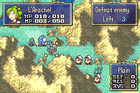

# Phoenix Staff

  

---

## Index
- [Introduction](#introduction)
- [Plan](#plan)
- [Code Locations](#code-locations)
- [TODO](#todo)
- [Limitations & Bugs](#limitations--bugs)

## Introduction

The **Phoenix Staff** revives a chosen dead blue unit from the current dead-unit roster and places that unit on a valid adjacent tile.

From the player’s perspective, the staff is designed to feel like a full revive action rather than a hidden event:

- It only appears when there is at least one valid dead blue unit to revive.
- It shows a scrollable list of dead units instead of forcing a single hardcoded target.
- It only accepts landing tiles that the revived unit can legally occupy.
- It plays the revive flow, shows a revive popup, and then displays the EXP bar after the popup completes.

The implementation intentionally reuses the existing item revamp, dead-unit tracking, menu scrolling, popup, and map-animation EXP systems already present in the project.

## Plan

Phoenix follows a short menu-to-revive pipeline:

| Step | Player Result | Implementation Responsibility |
|------|---------------|-------------------------------|
| 1 | The staff appears only when at least one dead blue unit exists | Read the dead-unit history and count valid entries with `GetDeadUnitCount` |
| 2 | The menu shows up to six visible rows and scrolls when needed | Cache the roster size, use `gTopVisibleListIndex`, and drive the scrollbar from the Phoenix menu state |
| 3 | Scrolling updates the portrait without opening help text | Redraw the currently highlighted unit portrait from the shared D-pad path and keep help-box behavior separate |
| 4 | Selecting a unit starts the revive flow | Store the chosen unit in `gActionData.targetIndex`, clear the menu state, and start the revive proc from player phase |
| 5 | The chosen unit reappears on a valid adjacent tile | Clear dead flags, move the unit to the chosen tile, restore 1 HP, and refresh the map and sprites |
| 6 | The revive popup appears, then EXP is shown afterward | Wait for `PhoenixStaffRevivedPopup` to finish, then hand off to `MapAnim_DisplayExpBar` so the standard EXP proc can run |

The menu is intentionally narrow in scope. Phoenix does not ask the player to choose among arbitrary dead units on the whole map; it only works with the tracked dead-unit list and only permits valid adjacent landing tiles.

## Code Locations

| Feature | Location | Description |
|--------|----------|-------------|
| **Phoenix staff usability / effect / action** | `IER_Usability_Phoenix`, `IER_Effect_Phoenix`, `IER_Action_Phoenix` in [`PhoenixStaff.c`](../../Data/CustomItems/PhoenixStaff/PhoenixStaff.c) | Entry points for checking whether the staff is usable, building the target list, and starting the revive proc |
| **Phoenix menu roster** | `PhoenixStaff_InitRoster`, `PhoenixStaff_GetVisibleCount`, `PhoenixStaff_HandleMenuScroll`, `PhoenixStaffMenu_OnDraw`, and `PhoenixStaffMenu_OnSwitchIn` in [`PhoenixStaff.c`](../../Data/CustomItems/PhoenixStaff/PhoenixStaff.c) | Builds the six-row scrollable menu, keeps the scrollbar in sync, and redraws the highlighted portrait |
| **Phoenix target validation** | `PhoenixStaff_IsValidDeadUnit`, `PhoenixStaff_CanUnitBePlacedAt`, `PhoenixStaff_CanAnyDeadUnitBePlacedAt`, and `MakeTargetListForPhoenix` in [`PhoenixStaff.c`](../../Data/CustomItems/PhoenixStaff/PhoenixStaff.c) | Filters the dead-unit list and builds the adjacent-tile target list around the active unit |
| **Phoenix revive proc** | `PhoenixStaff_Exec`, `PhoenixStaff_ShowPopup`, `PhoenixStaff_ShowExpBar`, and `ProcScr_PhoenixRevive` in [`PhoenixStaff.c`](../../Data/CustomItems/PhoenixStaff/PhoenixStaff.c) | Clears the dead state, shows the revive popup, and starts the EXP bar after the popup finishes |
| **Dead-unit history** | `GetDeadUnitCount`, `AddDeadUnit`, and `RemoveDeadUnit` in [`UnitKill.c`](../../Kernel/Wizardry/Common/UnitHooks/Source/UnitKill.c) | Maintains the dead-unit history that Phoenix reads when it builds its menu |
| **EXP bar proc** | `MapAnim_DisplayExpBar`, `ProcScr_AddExp`, and `ProcMAExpBar_LevelUpIfPossible` in [`MiscFunctions.c`](../../Kernel/Wizardry/Misc/MiscFunctions/Source/MiscFunctions.c) | Runs the shared map-animation EXP bar and triggers level-up handling when the EXP total crosses 100 |
| **Staff EXP calculation** | `GetBattleUnitStaffExpRework` and `BattleApplyItemExpGains` in [`BattleExp.c`](../../Kernel/Wizardry/Core/BattleSys/Source/BattleExp.c) | Computes the Phoenix Staff EXP gain and passes it into the battle EXP pipeline |
| **Menu input hook** | `ProcessMenuDpadInput` in [`MiscFunctions.c`](../../Kernel/Wizardry/Misc/MiscFunctions/Source/MiscFunctions.c) | Handles the shared menu scrolling and portrait redraw path used by Phoenix |

## TODO

- The Light Rune animation doesn't obey the given coordinates, likely because of the presence of the custom proc menu. To investigate

## Limitations & Bugs

- Phoenix only works with dead blue units that are already tracked in the dead-unit list. It does not search the entire map for arbitrary revival candidates.

- The menu only offers tiles that the selected unit can legally occupy. If no valid adjacent landing tile exists, the staff should remain unusable.

- The revive animation is currently minimal because the light-rune placement logic is still disabled in `PhoenixStaff_Anim`. If that coordinate handling is fixed later, the doc should be updated to describe the restored animation path.

Please report issues with roster scrolling, revive placement, popup timing, or EXP-bar sequencing in the repository’s Issues tab.