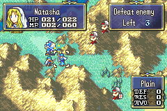

# Skill Staff

  

---

## Index
- [Introduction](#introduction)
- [Plan](#plan)
- [Code Locations](#code-locations)
- [TODO](#todo)
- [Limitations & Bugs](#limitations--bugs)

## Introduction

The **Skill Staff** lets the player choose one of 4 predefined skills and grant it to an adjacent allied unit for 3 turns.

From the player’s perspective, the staff is meant to behave like a real support action rather than a hidden script:

- It only appears when at least one adjacent ally can receive one of the listed skills.
- It opens a menu that shows the available skills for the chosen target.
- It shows a learned-skill popup when the skill is applied.
- It awards staff EXP and can level the staff user up.
- It removes the granted skill after 3 turns, but keeps the temporary state across suspend.
- It clears the granted skill on chapter restart and on chapter end.

The implementation uses the item revamp system, custom menu state, temporary skill tracking, popup rework, and the shared map-animation EXP pipeline already present in the project.

## Plan

The skill staff follows a short selection-to-reward pipeline.

| Step | Player Result | Implementation Responsibility |
|------|---------------|-------------------------------|
| 1 | The staff only appears when an adjacent ally can actually receive one of the listed skills | `SkillStaff_Usability` builds the target list and rejects units that already have no valid grantable skills |
| 2 | Selecting a target opens the skill menu | `IER_Effect_SkillStaff` starts target selection and `SkillStaff_OnSelectTarget` stores the chosen unit and skill list |
| 3 | The menu shows the available skills and a subtitle while it is open | `SkillStaff_StartSkillMenu` creates the menu proc, draws the portrait, and attaches the subtitle to the menu proc |
| 4 | Picking a skill grants it temporarily and shows the learned-skill popup | `SkillStaff_ApplyEffect` calls the temporary skill helper and then starts `PopupScr_LearnSkill` |
| 5 | The staff EXP bar appears after the popup and uses the battle snapshot value | `SkillStaff_ShowExpBar` reads the battle-unit EXP state and starts the shared map-animation exp bar proc |
| 6 | The granted skill expires after 3 turns, but survives suspend | `SkillStaff_TickCurrentTurn`, `SkillStaff_ClearSuspendState`, `SaveSkillStaffSuspendState`, and `LoadSkillStaffSuspendState` manage the temporary grant list |
| 7 | Chapter restart and chapter end clear the temporary grants | `ChapterInit_ResetSkillStaffTempState` and the suspend cleanup path remove any active staff-granted skills |

The skill list is intentionally small and explicit. The current grant table is limited to 4 skills, which keeps the menu readable and avoids turning the staff into a generic skill injector.

## Code Locations

| Feature | Location | Description |
|--------|----------|-------------|
| **Custom staff item** | `ITEM_STAFF_SKILL` in [`items.h`](../../../../Tools/FE-CLib-Mokha/include/constants/items.h) and [`Items.c`](../../../../Data/ItemSys/Source/Items.c) | Registers the staff item itself, including its name, description, range, icon, and revamp effect ID |
| **Revamp dispatch** | `IER_STAFF_SKILL` in [`item-sys.h`](../../../../include/kernel/item-sys.h) and [`IERevampTable.c`](../../../../Kernel/Data/ItemSys/Source/IERevampTable.c) | Hooks the staff into the item revamp table so the game can call its usability, effect, and action handlers |
| **Main staff flow** | `IER_Usability_SkillStaff`, `IER_Effect_SkillStaff`, and `IER_Action_SkillStaff` in [`SkillStaff.c`](../../../../Data/CustomItems/SkillStaff/SkillStaff.c) | Entry points for the item system; they decide whether the staff can be used, open target selection, and start the main proc chain |
| **Menu proc chain** | `SkillStaff_StartSkillMenu`, `SkillStaffMenu_OnSelected`, `SkillStaffMenu_OnCancel`, and `ProcScr_SkillStaffApply` in [`SkillStaff.c`](../../../../Data/CustomItems/SkillStaff/SkillStaff.c) | Owns the custom skill menu, handles confirm/cancel, and sequences the popup and EXP steps |
| **Target filtering** | `SkillStaff_TargetHasAnyGrantableSkill`, `SkillStaff_BuildGrantableSkillList`, and `SkillStaff_Usability` in [`SkillStaff.c`](../../../../Data/CustomItems/SkillStaff/SkillStaff.c) | Filters adjacent allies and removes units that already have no valid staff-granted skill options |
| **Temporary skill grant** | `SkillStaff_AddTemporarySkill` and the `SkillStaffGrantEntry` / `SkillStaffSuspendState` structs in [`SkillStaff.c`](../../../../Data/CustomItems/SkillStaff/SkillStaff.c) | Applies the skill, records the 3-turn timer, and tracks the active grant in RAM |
| **Duration ticking and cleanup** | `SkillStaff_TickCurrentTurn`, `SkillStaff_TickSuspendState`, `SkillStaff_ClearSuspendState`, `ChapterInit_ResetSkillStaffTempState` in [`SkillStaff.c`](../../../../Data/CustomItems/SkillStaff/SkillStaff.c) | Removes expired grants, clears all grants on chapter restart, and keeps the timer from double-ticking on the same turn |
| **Suspend persistence** | `SaveSkillStaffSuspendState` and `LoadSkillStaffSuspendState` in [`SkillStaff.c`](../../../../Data/CustomItems/SkillStaff/SkillStaff.c) plus [`SaveData/data.event`](../../../../Kernel/Wizardry/Common/SaveData/data.event) | Stores the temporary grant list across suspend and restores it when the chapter resumes |
| **Chapter and pre-phase hooks** | [`ChapterInitHook/data.event`](../../../../Kernel/Wizardry/Common/ChapterInitHook/data.event) and [`PrePhaseHook/data.event`](../../../../Kernel/Wizardry/Common/PrePhaseHook/data.event) | Calls the chapter restart cleanup and the per-turn expiration tick |
| **Menu subtitle** | `StartSubtitleHelp(menu, ...)` in [`SkillStaff.c`](../../../../Data/CustomItems/SkillStaff/SkillStaff.c) | Attaches the "Select a skill to learn." subtitle to the live menu proc so it appears while the menu is open |
| **Learned-skill popup** | `PopupScr_LearnSkill` usage in [`SkillStaff.c`](../../../../Data/CustomItems/SkillStaff/SkillStaff.c) and the popup rework in [`LearnSkill.c`](../../../../Kernel/Wizardry/Core/SkillSys/kernel/LearnSkill.c) | Shows the unit name and skill being learned after the choice is confirmed |
| **EXP bar** | `SkillStaff_ShowExpBar` in [`SkillStaff.c`](../../../../Data/CustomItems/SkillStaff/SkillStaff.c) and `ProcScr_MapAnimExpBar` / `ProcScr_AddExp` in [`MiscFunctions.c`](../../../../Kernel/Wizardry/Misc/MiscFunctions/Source/MiscFunctions.c) | Displays the staff EXP reward and reuses the shared map-animation EXP system |
| **Staff EXP value** | `StaffEXP(ITEM_STAFF_SKILL)` in [`BattleExp.c`](../../../../Kernel/Wizardry/Core/BattleSys/Source/BattleExp.c) | Sets the base EXP reward for the staff |
| **Text entries** | `MSG_ITEM_SKILL_STAFF_SUBTITLE` and `MSG_ITEM_SKILL_STAFF_SKILL_SUBTITLE` in [`Items.txt`](../../../../Contents/Texts/Source/texts/Items.txt) | Holds the visible prompt text for the target-selection and menu-selection steps |
| **Memmap storage** | `sSkillStaffMenuState` and `sSkillStaffSuspendState` in [`config-memmap.s`](../../../../include/link/config-memmap.s) | Reserves RAM for the menu state and the suspend-safe temporary grant list |

## Memory Use

The staff uses two small RAM blocks because it needs to share state across menu callbacks and across suspend/load.

| Memory | Size | Used For |
|-------|------|----------|
| `sSkillStaffMenuState` | 16 bytes | Stores the selected target unit, whether the menu is active, whether the player confirmed a choice, the 4 candidate skill IDs, and the current choice count. This is the scratch state the menu and action proc use while the skill menu is open. |
| `sSkillStaffSuspendState` | 68 bytes | Stores the active temporary skill grants plus the last ticked turn number. Each grant records the unit, the remaining turns, and the granted skill ID. This is the suspend-safe state that gets written to SRAM and restored after loading a suspend. |

The menu block stays small because it only needs to survive the short target-selection flow. The suspend block is larger because it must keep the full active grant table alive between map sessions, and it must preserve enough metadata to avoid ticking the same turn twice.

## TODO

- Decide whether the four-skill grant list should stay fixed or be made data-driven later.

## Limitations & Bugs

- A unit can only have one active staff-granted temporary skill entry at a time. If a unit already has one of the tracked grants, the target is excluded from the usability list.

- The temporary skill state is capped by `SKILL_STAFF_MAX_ACTIVE`. That is enough for the current design, but it is a hard limit and should be revisited if the staff ever becomes more broadly available.

Please report issues with target filtering, subtitle timing, popup order, EXP display, or temporary-skill cleanup in the repository’s Issues tab.
