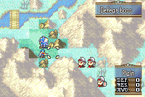

# Make Fog Great Again!

<p align="center">
  
</p>

---

## 📑 Index
- [Introduction](#introduction)
- [Plan](#plan)
- [Code Locations](#code-locations)
- [TODO](#todo)
- [Limitations & Bugs](#limitations--bugs)

---

## 🧩 Introduction

This project aims to make **fog of war** a more strategic and engaging gameplay element.

Historically, fog has been a controversial mechanic in Fire Emblem.  
Its default GBA implementation contradicts core strategy design principles: players are expected to make informed decisions based on map information, yet fog removes information and penalizes players for guessing wrong.

Vanilla fog issues include:

- Enemy units outside a unit’s sight radius are completely hidden  
- Running into hidden enemies **ends your turn immediately**  
- Enemy units enjoy unfair omniscient vision of the entire map when enemy fog vision is disabled

This system seeks to address those problems.

---

## 🛠️ Plan

To improve fog, this redesign introduces **three distinct fog stages**:

```
        3
      3 2 3
    3 2 1 2 3
  3 2 1 0 1 2 3
3 2 1 0 U 0 1 2 3
  3 2 1 0 1 2 3
    3 2 1 2 3
      3 2 3
        3
```


### How It Works

The internal `gBmMapFog` map cell value determines each enemy's stage:

| Stage | `gBmMapFog` | On map? | Sprite | Stat screen | Forecast | Minimug box |
|-------|-------------|---------|--------|-------------|----------|-------------|
| **U** | — | — | Player unit | — | — | — |
| **0** | ≥ 3 | Yes | Real class sprite | Accessible | Full info | HP/MP shown |
| **1** | 2 | Yes | Real class sprite | Blocked | Name & stats hidden | Blank (no HP/MP) |
| **2** | 1 | Yes | Hidden "shadow" sprite | Blocked | Name & stats hidden | Blank box |
| **3** | 0 | No | Invisible | Blocked | Cannot target | N/A |

This layered fog provides partial information instead of the all-or-nothing approach of vanilla fog, leading to more strategic decision-making.

Enemy AI fog knowledge is documented separately in [Enemy Fog Vision](EnemyFogVision.md). That system does not change the player-facing stage table above.

---

## 🗂️ Code Locations

Player fog-stage modifications are gated behind `gpKernelDesignerConfig->multiple_fog_stages` in `designer-config.c`.

| Feature | Location | Description |
|--------|----------|-------------|
| **Fog map population** | `RefreshUnitsOnBmMap` in [`MiscFunctions.c`](../../Kernel/Wizardry/Misc/MiscFunctions/Source/MiscFunctions.c) | Builds the graduated `gBmMapFog` cell values and decides which enemies are placed on `gBmMapUnit` (stage 3 enemies are withheld entirely) |
| **Enemy AI vision** | [Enemy Fog Vision](EnemyFogVision.md) | Separate shared faction vision for non-player AI; does not rewrite `gBmMapFog` |
| **Stage 2 sprite rendering** | `RefreshUnitSprites` and `PutUnitSpritesOam` / `PutFogStage2Sprites` in [`MirrorSprites.c`](../../Kernel/Wizardry/Misc/MirrorMapSprites/MirrorSprites.c) | Suppresses the real class sprite for stage 2 units and draws a bobbing "shadow" sprite (link-arena hidden-unit sheet) in its place |
| **Stat screen accessibility** | `CanShowUnitStatScreen` and `FindNextUnit` in [`AccessStatScreen.c`](../../Data/StatScreen/Source/AccessStatScreen.c) | Blocks the stat screen and unit-browsing for any unit at stages 1–3 (`gBmMapFog < 3`) |
| **Battle forecast data visibility** | `DrawBattleForecastContentsStandard` and `DrawBattleForecastContentsExtended` in [`BattleForcast.c`](../../Kernel/Wizardry/Core/CombatArt/BKSELfx/Source/BattleForcast.c) | Replaces the target's name and weapon with "N/A", and blanks all combat stat values, for stages 1–2 |
| **Minimug box (MMB)** | `DrawUnitMapUi`, `UnitMapUiUpdate`, and `MMB_Slide_Common` in [`ModularMinimugBox.c`](../../Kernel/Wizardry/Misc/ModularMinimugBox/ModularMinimugBox.c) | Shows an empty box (no name, no portrait, no HP/MP) for stage 2 units; correctly transitions `hideContents` during slide-in/out so HP/MP digits appear or stay hidden as the cursor moves between fog stages |

---

## 📝 TODO

- Continue refining multi-layer fog palette coexistence within GBA hardware limits.

---

## 🐛 Limitations & Bugs

There are technical challenges around rendering multiple fog layers simultaneously. Ideally, all fog patterns should programmatically coexist as long as the palette remains within hardware limits.

Please report any issues in the repository’s **Issues** tab.

---
