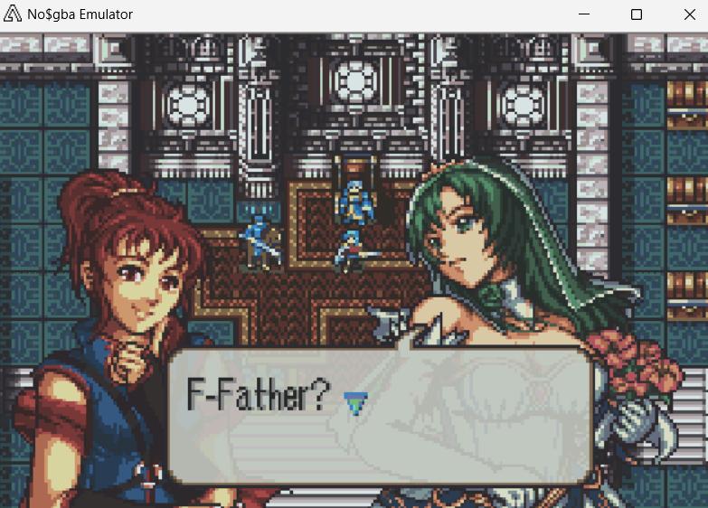

# Halfbodies

<p align="center">
  
</p>

---

## 📑 Index
- [Introduction](#introduction)
- [Plan](#plan)
- [Code Locations](#code-locations)
- [How To Use](#how-to-use)
- [TODO](#todo)
- [Limitations & Bugs](#limitations--bugs)

---

## 🧩 Introduction

`CONFIG_HALF_BODY_PORTRAITS`

This is a system that was originally developed by the genius Ryrumeli and than redesigned from scratch by Kirb.

It allows for the use of taller portraits in the style of FE9/FE10 whilst also moving the text box to accomodate.

---

## 🛠️ Plan

- Stack two portraits on top of eachother
- Each portrait will have its own 16 color palette, allowing for 32 colors for the entire halfbody
- Regular portraits will be showing in stat screens, when trading etc

---

## 🗂️ Code Locations

| Feature | Location | Description |
|--------|----------|-------------|
| **Halfbody Installer** | [`HalfBodyPortraits_Installer.event`](../../Kernel/Wizardry/Misc/HalfBodyPortraits/HalfBodyPortraits_Installer.event) | Handles the combining of portraits, moving of textboxes etc |
| **Portrait Installation** | [`CustomPortraits.event`](../../Data/CustomPortraits/CustomPortraits.event) | Where portraits are installed |

---

## 🚀 How To Use

1) Go to the custom portraits folder the CustomPortrait event file above is next to
2) Use the _TEMPLATE.png file to create your halfbodies
3) Insert them in CustomPortraits using the following syntax:

```
Portrait_0x51:
   #incext HalfbodyFormatter "Portraits/Anna.png"
setMugEntry_Halfbody(0x51,Portrait_0x51,3,7,3,5)
```

- ``Portrait_0xXX:`` is the label, we'll call this in the setMugEntry function
- Inside the label, we insert this PNG where this label is located using the ``HalfBodyFormatter`` tool (currently only an EXE)
- Then in the ``setMugEntry_HalfBody`` function we have the following parameters
  - The portrait ID we're using
  - The portrait label
  - The mouth frame X location
  - The mouth frame Y location
  - The eye frame X location
  - The eye frame Y location

## 📝 TODO

- This is more general, but allow more mouth frames to show additional
emotions without requiring seperate portraits.

---

## 🐛 Limitations & Bugs

Please report issues or enhancement requests in the repository’s **Issues** tab.

- The system is all or nothing. If you use it, **every** portrait must be a halfbody or the regular ones will glitch underneath.
- Only two halbodies can be loaded at once due to space constraints in the OBJ Tile space. A third might be possible,
but we would have to sacrifice eye and mouth frames and rejig where the location of the portraits again in OBJ space.
- The halfbody formatter currently only exists as an EXE (as Kirb never made the source public) so this buildfile assumes the EXE
will sit in your C drive in the downloads folder. A copy of it is in this buildfile in the tools directory of EA for your convinience to move there.
Thus if you're planning to use this system, you'll need to be running this buildfile off WSL, pure Linux setups aren't currently supported.
- https://github.com/JesterWizard/C-SkillSystem-Jester/issues/378
- https://github.com/JesterWizard/C-SkillSystem-Jester/issues/379

---