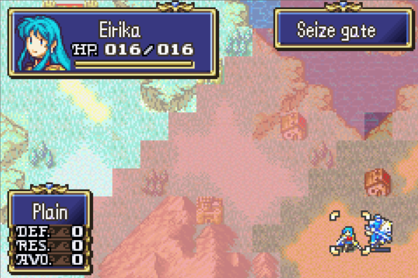

# Seeing Red: Magic Seal Visuals

<p align="center">
  
</p>

---

## 📑 Index
- [Introduction](#introduction)
- [Plan](#plan)
- [Code Locations](#code-locations)
- [TODO](#todo)
- [Limitations & Bugs](#limitations--bugs)

---

## 🧩 Introduction

Vanilla Magic Seal (`CA_MAGICSEAL`) already blocks magic/staves in a 10-tile Manhattan radius, and this kernel also exposes that behavior as the **Magic Seal** skill.

What it lacked was a clear on-map cue. Vanilla only forced fog palette banks by writing `-1` into `gBmMapFog`, which:

- Fought real fog of war / multi-stage fog
- Remapped terrain through the wrong subpalette banks (noisy / glitched tiles)
- Was easy to miss as a “sealed zone” signal

This feature keeps gameplay seal checks separate from fog data, and draws a soft red wash only on sealed tiles.

---

## 🛠️ Plan

### Gameplay (unchanged contract)

| Source | Range | Effect |
|--------|-------|--------|
| Unit with `CA_MAGICSEAL` | 10 tiles | Units in range cannot use magic / staves |
| Unit with `SID_MagicSeal` | 10 tiles | Same |
| Silenced unit | — | Treated as sealed via `IsUnitMagicSealed` |
| Map events running (`EventEngineExists`) | — | Seal checks return false (no seal during pre/post chapter events) |

### Visual model

| Layer | Role |
|-------|------|
| **BG3 map tiles** | Normal lit / fog shading only — fog palette banks **11–15 are never tinted red** |
| **BG2 wash** | Solid 4bpp metatile + alpha blend (`8/8`) in seal red (`≈ 0x319D`, or fog bank 11 color 5 if present) |
| **Coverage** | Only tiles where a seal source is within range 10 |

```
Seal source S
        10
      … S …
        10

BG2 red wash covers every map cell with RECT_DISTANCE(S, cell) ≤ 10
(union of all seal sources, up to 8 tracked for the overlay draw)
```

### Why not fog palettes?

GBA map fog uses five palette banks with per-tile subpalette offsets. Forcing one bank or globally tinting banks 11–15 either glitches terrain or paints the whole fog path red. The BG2 blend wash is seal-only and leaves fog cosmetics alone.

### Performance / coexistence

| Situation | Behavior |
|-----------|----------|
| Cursor moves within a map tile | Only BG2 scroll + cheap blend refresh |
| Camera crosses a map tile / map refresh marks dirty | Collect seal sources once, redraw visible BG2 cells |
| Move / attack range UI (`BM_FLAG_0`) | Overlay yields BG2 — does **not** `BG_Fill` (that erased blue range tiles) |
| CHR ownership | Seal uses `BGCHR_LIMITVIEW + 8` (`0x288`), not `0x280–0x287` range squares |

Dirty refresh is kicked from the end of `RefreshUnitsOnBmMap` via `UpdateMagicSealVisualPalette()`.

---

## 🗂️ Code Locations

| Feature | Location | Description |
|--------|----------|-------------|
| **Seal gameplay check** | `IsPositionMagicSealed` / `IsUnitMagicSealed` in [`MiscGetter.c`](../../Kernel/Wizardry/Core/UnitStatusGetter/source/MiscGetter.c) | Range-10 scan over `CA_MAGICSEAL` / `SID_MagicSeal`; skips while events run; silence still seals the unit |
| **Red wash overlay** | `MagicSealOverlay_OnLoop`, `DrawSealOverlayTiles`, `CollectMagicSealSources` in [`MagicSealVisual.c`](../../Kernel/Wizardry/Common/MagicSealVisual/MagicSealVisual.c) | BG2 solid-tile blend overlay; dirty / camera-tile redraw; yields to move-range UI |
| **Map refresh hook** | `UpdateMagicSealVisualPalette` called from `RefreshUnitsOnBmMap` in [`MiscFunctions.c`](../../Kernel/Wizardry/Misc/MiscFunctions/Source/MiscFunctions.c) | Unpacks chapter map palettes and marks the overlay proc dirty after entity maps refresh |
| **Installer** | [`MagicSealVisual_Installer.event`](../../Kernel/Wizardry/Common/MagicSealVisual/MagicSealVisual_Installer.event) (via `wizardry-data.event`) | Lyn event + `DisplayBmTile` jump |
| **Skill text** | `MSG_SKILL_MagicSeal_*` in [`Skills_Debuff.txt`](../../Contents/Texts/Source/texts/Skills_Debuff.txt) | Player-facing name / description |

---

## 📝 TODO

- Optional designer-config toggle to disable the wash while keeping gameplay seal
- Animate or pulse the wash subtly without reintroducing per-frame full redraws

---

## 🐛 Limitations & Bugs

- BG2 is shared with move/attack range: while range UI is up, the red wash is hidden.
- Overlay tracks at most **8** seal sources for drawing (gameplay checks still scan all units).
- Blend coefficients are fixed (`SetBlendAlpha(8, 8)`); other map FX that fight BG2 blend can briefly fight the wash until the next dirty refresh.
- Do not write Magic Seal into `gBmMapFog` for cosmetics — that path conflicts with real fog.

Please report any issues in the repository’s **Issues** tab.

---
