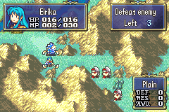

# Snek Minigame

<p align="center">
  
</p>

---

## 📑 Index
- [Introduction](#introduction)
- [Plan](#plan)
- [Code Locations](#code-locations)
- [Event Usage](#event-usage)
- [TODO](#todo)
- [Limitations & Bugs](#limitations--bugs)

---

## 🧩 Introduction

**Snek** is a house minigame that runs as an ASMC-driven event sequence. The player is shown the opening conversation, can accept or decline the game, and then plays the snake minigame inside the event engine.

The goal is to make the house interaction feel like a complete side activity rather than a one-off cutscene. The event flow now supports three outcomes after the game ends: win, draw, or lose.

## 🛠️ Plan

The Snek flow is split into two parts:

| Stage | Behavior |
|------|----------|
| Opening | Show `GAME_SNEK_CONVO_BEGIN` and wait for the player to choose Yes or No. |
| Accept | If the player selects Yes, play `GAME_SNEK_CONVO_YES`, then start the Snek ASMC. |
| Decline | If the player selects No, play `GAME_SNEK_CONVO_NO` and end the event. |
| Post-game | Compare current score against the saved high score and write the result into event slots. |
| Result | Use the event slot result to play the win, draw, or lose conversation. |

The current implementation uses a tiny helper in C to write the outcome into `EVT_SLOT_7`, `EVT_SLOT_8`, and `EVT_SLOT_9`. The event script then branches on those values.

### Outcome Mapping

| Result | Slot 7 | Meaning |
|--------|--------|---------|
| Win | `0` | Current score is greater than the high score |
| Draw | `1` | Current score matches the high score |
| Lose | `2` | Current score is below the high score |

`EVT_SLOT_8` is set to `0` and `EVT_SLOT_9` is set to `1` so the branch comparison can stay explicit and readable.

## 🗂️ Code Locations

| Feature | Location | Description |
|--------|----------|-------------|
| Minigame runtime | `CallSnekMinigameASMC` in [`Kernel/Wizardry/Misc/Minigames/Snek/Snek.c`](../../../Kernel/Wizardry/Misc/Minigames/Snek/Snek.c) | Starts the blocking Snek proc from events. |
| Result slot writer | `Snek_SetOutcomeEventSlots` in [`Kernel/Wizardry/Misc/Minigames/Snek/Snek.c`](../../../Kernel/Wizardry/Misc/Minigames/Snek/Snek.c) | Compares current score to the high score and writes the result to event slots. |
| Snek declarations | [`Kernel/Wizardry/Misc/Minigames/Snek/Snek.h`](../../../Kernel/Wizardry/Misc/Minigames/Snek/Snek.h) | Exposes the Snek entry points and shared globals. |
| Chapter-one house hook | `EventListScr_GAME_SNEK` in [`Data/FE8_Rewritten_Terper/Event/Source/01/Source/Events.h`](../../../Data/FE8_Rewritten_Terper/Event/Source/01/Source/Events.h) | Shows the conversation, runs the minigame, and branches to the correct ending text. |
| Dialogue text | [`Data/FE8_Rewritten_Terper/Text/Games/Snek.txt`](../../../Data/FE8_Rewritten_Terper/Text/Games/Snek.txt) | Holds the opening, accept/decline, and result conversations. |

## 🎮 Event Usage

Use the ASMC directly from a talk event or any other event list when you only want to start the minigame:

```event
static const EventListScr EventScr_Talk_SNEK[] = {
    ASMC(CallSnekMinigameASMC)
    NOFADE
    ENDA
};
```

The expected flow is simply:

1. A talk event or house event starts.
2. `ASMC(CallSnekMinigameASMC)` runs the minigame.
3. Execution returns to the event after the proc ends.

## 📝 TODO

- Add the finalized house-event branch flow once it is ready.
- Add a screenshot or GIF once the chapter-one encounter is finished.
- Revisit the result conversation names if the event flow changes.

## 🐛 Limitations & Bugs

- The event flow depends on the Snek minigame helper writing valid values into the event slots before branching.
- The draw conversation label is currently spelled `GAME_SNEK_CONGO_END_DRAW` in the text file.
- The documentation reflects the current chapter-one implementation and may need a small update if the house flow changes in later chapters.
