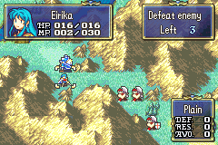

# Prestige

  

---

## 📑 Index
- [Introduction](#introduction)
- [Plan](#plan)
- [Code Locations](#code-locations)
- [TODO](#todo)
- [Limitations & Bugs](#limitations--bugs)

---

## 🧩 Introduction

Prestige gives unpromoted units a repeatable reset loop modeled after incremental-RPG prestige systems.

When the feature is enabled, a qualifying unit can use the Prestige command from the unit action menu. Prestige resets the unit to level 1, restores base stats from the character's default class entry, clears status, refills HP, and permanently increases all growths by `+10%` per prestige count up to a cap of `3`.

The system is gated behind `gpKernelDesignerConfig->prestige`, so a project can keep the code and BWL data in place while turning the feature off at runtime.

Player-facing rules:
- Only unpromoted units can Prestige.
- The unit must be at least level 10.
- The unit can Prestige up to `3` times.
- The growth bonus and stat-screen stars both disappear when the designer-config toggle is disabled.

## 🛠️ Plan

Prestige follows a small BWL-backed loop.

| Step | Behavior | Result |
|------|----------|--------|
| 1 | Check `gpKernelDesignerConfig->prestige` before showing the command or applying bonuses. | Designers can disable the whole feature without removing save data or code hooks. |
| 2 | Check unit legality: valid unit, not cantoing, unpromoted, level 10+, and under the Prestige cap. | The menu option only appears for units that are actually allowed to Prestige. |
| 3 | Increment `prestigeAmt` in BWL and safely write level 1. | The persistent Prestige counter survives while level bookkeeping stays in sync with hidden-level handling. |
| 4 | Restore the unit's default-class baseline stats and clear transient state. | The unit re-enters play as a fresh version of the base class instead of keeping post-level-up stats. |
| 5 | Add `10 * prestigeAmt` to the shared growth bonus path. | All growth getters inherit the Prestige bonus automatically. |
| 6 | Draw one star per Prestige count on the left stat-screen page. | Players can verify Prestige progress directly from the stat screen. |

## 🗂️ Code Locations

All runtime behavior is gated behind `gpKernelDesignerConfig->prestige` in [`kernel-lib.h`](../../include/kernel/kernel-lib.h) and [`designer-config.c`](../../Data/DesignerConfig/designer-config.c).

| Feature | Location | Description |
|--------|----------|-------------|
| Designer config flag | `KernelDesigerConfig` in [`kernel-lib.h`](../../include/kernel/kernel-lib.h) | Adds the runtime boolean that turns the Prestige feature on or off. |
| Default value | `gKernelDesigerConfig` in [`designer-config.c`](../../Data/DesignerConfig/designer-config.c) | Enables Prestige by default so current projects keep the feature unless they disable it. |
| Unit-menu availability | `PrestigeCommandUsability` in [`PrestigeCommand.c`](../../Data/UnitMenu/Source/PrestigeCommand.c) | Hides the command unless the config is enabled and the active unit satisfies the Prestige requirements. |
| Prestige reset effect | `PrestigeCommandEffect` in [`PrestigeCommand.c`](../../Data/UnitMenu/Source/PrestigeCommand.c) | Increments `prestigeAmt`, resets level and stats, clears status, and restores HP. |
| Growth bonus hook | `GetUnitCommonGrowthBonus` in [`GrowthGetter.c`](../../Kernel/Wizardry/Core/Lvup/Source/GrowthGetter.c) | Adds the per-Prestige growth bonus through the shared growth-bonus path used by all stats. |
| Stat-screen stars | `DisplayPrestigeStars` and `DisplayLeftPanel` in [`DrawPageLeft.c`](../../Kernel/Wizardry/Core/StatScreen/DrawPages/DrawPageLeft.c) | Draws up to three Prestige stars on the left stat-screen page when the feature is enabled. |
| BWL storage | `NewBwl` in [`bwl.h`](../../include/kernel/bwl.h) | Stores the persistent `prestigeAmt` counter used by the menu, growth bonus, and UI. |
| Debug editing | `EditBwlStatsInit`, `SaveBwlStats`, and `EditBwlStatsIdle` in [`C_Code.c`](../../Kernel/Wizardry/Misc/VeslyDebugger/C_Code.c) | Lets the Vesly debugger inspect and edit the BWL Prestige counter directly. |

## 📝 TODO

- Consider adding popup feedback when Prestige is used.
- Consider exposing the growth bonus per Prestige and max Prestige count as designer-config values if projects want different balance.
- Review whether the stat-screen star position should move when other left-page UI elements are expanded.

## 🐛 Limitations & Bugs

- `Patches/PATCH_DesignerConfig.txt` currently exposes only the first 32 bytes of `gKernelDesigerConfig`, so the new `prestige` flag is runtime-only unless the editor patch is expanded separately.
- The maximum Prestige count is hard-capped to `3`.
- The Vesly debugger can still edit `prestigeAmt` even when the feature is disabled; the runtime toggle simply stops the menu, growth bonus, and stat-screen display from using it.

Please report any issues in the repository's Issues tab.
