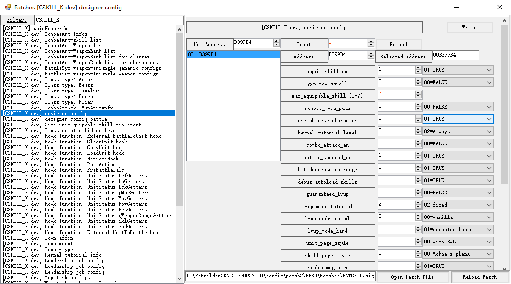
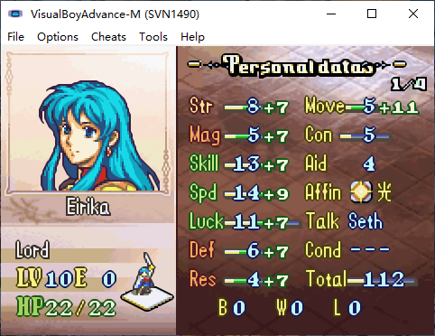
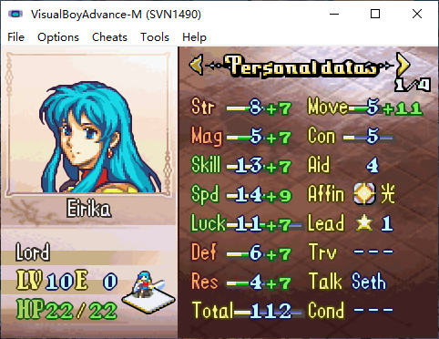
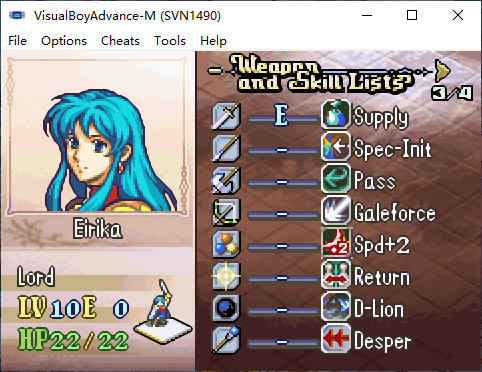
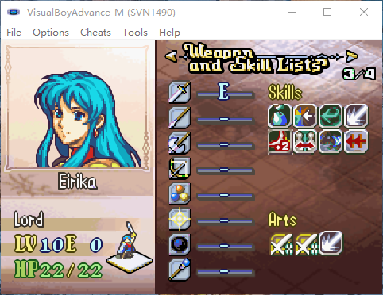
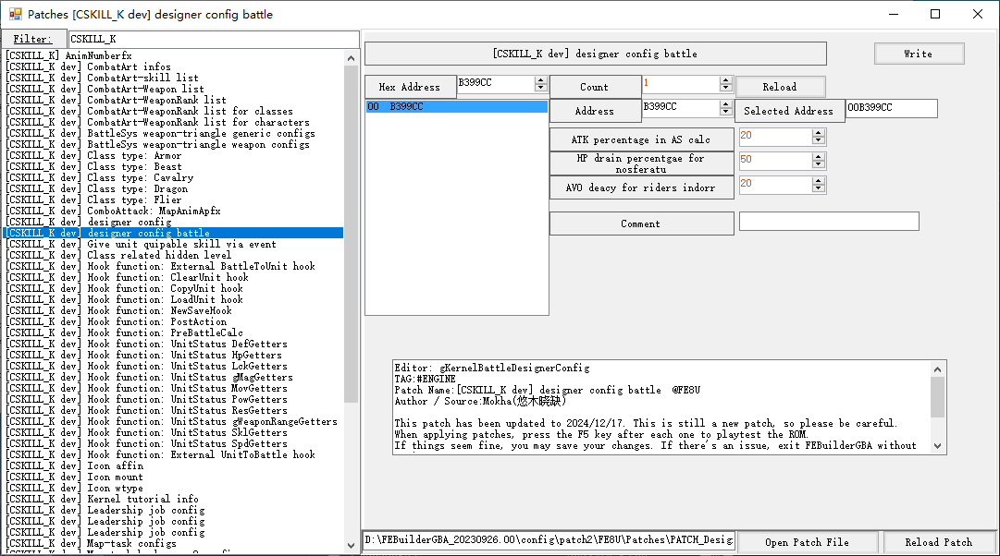
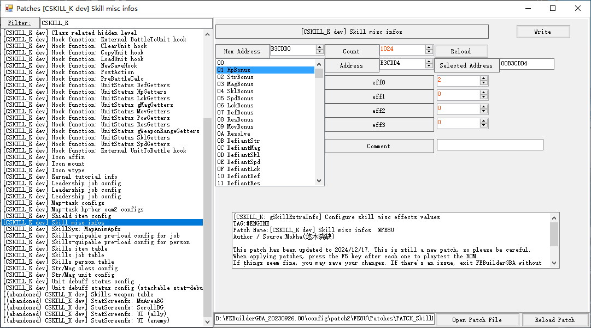

# System Config

C-SkillSys includes designer-facing configuration patches that let you change important gameplay behavior without editing source code. This page summarizes the main config groups and explains what each option controls.

## Designer config

Use this config table for high-level gameplay toggles, UI behavior, and progression rules.

| Field | Description |
| :---- | :---------- |
| `prep_menu_skills` | Enables Three Houses style skill equipment in the prep screen. If disabled, the skill equip option is removed. |
| `gen_new_scroll` | Controls what happens when a unit uses a skill scroll while all equipable skill slots are full. |
| `max_equipable_skill` | Maximum number of dynamically equipable skills per unit, from `0` to `7`. |
| `remove_move_path` | Disables move-path calculation and display. This is useful because vanilla move-path display only supports up to 20 steps and can overflow with high-move units. |
| `translucent_unit_sprite` | While pathfinding (and `remove_move_path` is off), shows a Lex Talionis-style faded MU ghost at the cursor tip. See [TranslucentUnitSprite](./TranslucentUnitSprite.md). |
| `vesly_extended_help_boxes` | Help-box overflow mode: `0` vanilla truncate, `1` extended 5-line, `2` paginated 3-line with A to cycle pages. See [PaginatedHelpBoxes](./PaginatedHelpBoxes.md). |
| `hit_decrease_on_range` | Enables Three Houses style hit loss for long-range attacks. |
| `debug_autoload_skills` | Debug option that fills a unit's learned skill list so skills can be freely equipped in the prep screen. |
| `guaranteed_lvup` | If a level-up would grant no stat gains, the kernel retries up to 10 times with a 10% growth bonus. |
| `unit_page_style` | Controls the display style for stat screen page 1. |
| `skill_page_style` | Controls the display style for stat screen page 3. |
| `gaiden_magic` | Enables Gaiden-style black and white magic. |
| `gaiden_magic_must_be_magic` | Allows non-magic items to appear in Gaiden black/white magic selection. |
| `gaiden_magic_requires_wrank` | If enabled, units that can use a spell may ignore its weapon-rank requirement. |
| `gaiden_magic_ai_use` | Allows enemies to use Gaiden magic during AI phase. |
| `menu_skill_ai_use` | Allows enemies to use menu skills during AI phase after combat and healing logic finishes. |
| `rescue_drop_ai_use` | Allows enemies to use rescue and drop as a retreat tool when an adjacent ally is below half HP. |
| `start_map_effects` | Enables the pre-phase Start Map Effects menu and its related hooks. |
| `prestige` | Enables the Prestige system's unit-menu command, the +10% growth bonus per prestige, and the Prestige stars on the left stat-screen page. |
| `gaiden_magic_skill_extensions` | Wizardry option that enables `gGaidenChaxConfigs` checks. |
| `auto_narrow_font` | Converts ASCII text to narrow font when displaying skill descriptions, skill names, and menu items. |
| `skill_sub_menu_width` | Sets the width of the action menu's Skills submenu. |
| `wrank_bonux_rtext_auto_gen` | Automatically shows weapon-rank battle bonus information in the stat screen when available. |
| `enemy_can_combo_attack` | Allows enemies to participate in combo attacks. |
| `banim_switcher_en` | Enables the Custom Banim Switcher patch. See [BanimFeatures](./BanimFeatures.md). |
| `max_level` | Maximum displayed unit level, from `0` to `25`. |
| `max_level_record` | Maximum total level, including current and hidden level, from `0` to `80`. See [SkillSys.md](./SkillSys.md). |
| `dynamic_weapon_slots` | Enables per-class weapon-type-to-rank-slot mapping so custom types (knives, guns, etc.) can use unused `Unit::ranks` slots. See [DynamicWeaponSlots.md](./DynamicWeaponSlots.md). |

### Skill Scroll Behavior

`gen_new_scroll` uses the following modes.

- `0`: Three Houses style. The new skill is added to the unit's learned skill list and can be equipped later in the prep screen.
- `1`: Older style. The player may remove an existing skill from the unit and generate a new skill scroll.

### Unit Page Style

- `0`: 
- `1`: 

### Skill Page Style

- `0`: 
- `1`: 

## Designer config battle

This table controls combat formula tuning.

| Field | Description |
| :---- | :---------- |
| `ATK percentage in AS calc` | Changes attack speed decay from `weight - con` to `weight - (con + atk * percentage)`. |
| `HP drain percentgae for nosferatu` | Sets the default HP drain percentage for Nosferatu-style effects. This has lower priority than the [kernel item config table](../Data/BattleSys/WeaponHpDrain.c). |
| `AVO deacy for riders indorr` | Applies an avoid penalty to mounted units indoors. |
| `CRIT damage correction rate` | Sets critical hit damage percentage. |
| `Critical rate bonus for cavalry` | Applies a crit rate adjustment to cavalry classes. |
| `Critical rate bonus on attributes bit` | Grants a crit bonus if the Myrmidon/Swordmaster bit in `Ability3` is set. |
| `combo_base_damage` | Base damage used in combo-attack calculations. |
| `combo_additional_damage_en` | Enables the additive combo damage term. |
| `combo_additional_damage_perc` | Percentage multiplier used for the additive combo damage term. |
| `battle_followup_speed_threshold` | Configurable value for vanilla `BATTLE_FOLLOWUP_SPEED_THRESHOLD`. |

### Combo Attack Formula

If combo bonus damage is enabled, combo attack damage is calculated as:

`combo_base_damage + [atk - def] * combo_additional_damage_perc% * !!combo_additional_damage_en`

## Skill misc infos

This table lets designers tune skill-specific numeric values. The meaning of each entry depends on the skill that reads it.

Be careful when changing these values. They are lower-level balance and behavior controls, and incorrect values can introduce bugs.
