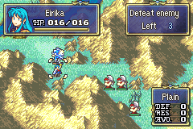

# Time Your Levels

  

---

## 📑 Index
- [Introduction](#introduction)
- [Plan](#plan)
- [Code Locations](#code-locations)
- [TODO](#todo)
- [Limitations & Bugs](#limitations--bugs)

---

## 🧩 Introduction

Vanilla GBA Fire Emblem rolls each stat independently. [Allocate Stat Points](AllocateStatPoints.md) lets the player choose which stats go up, but the number of gains is fixed.

Timing Stat Level-Up turns those growth rolls into a skill check. After the EXP bar, the eight-stat menu appears, and each row has an arrow that runs back and forth on a ten-dash track. Growth fills green bars from the left. Press A while the arrow is on a green bar to grant `+1` to that stat. Miss, and that attempt is spent.

A practiced player can convert every green bar into a gain. That is the intended ceiling, not a bug.

This replaces random `UnitLvupCore` rolls, but it still uses the unit's growths. Set `lvup_stat_timing` to `0` to restore vanilla level-ups (unless Allocate is also on). If both configs are on, timing wins.

Player-facing rules:
- Only blue units play the minigame.
- The list appears automatically after the EXP bar on the map, in battle animations, and in BEXP.
- Stats are in the left window. The timing tracks are in a matching-height window to the right.
- Each `10%` of growth lights one bar from the left. `1–10%` still fills one bar, so `1%` and `10%` both get a single green dash.
- Growths of `100%` or more grant extra attempts on that same row. `160%` is a guaranteed all-green first pass, then a second pass with 6 green bars.
- A green arrow is a hit. A gold arrow is a miss if you press A. After the last attempt on a stat, that arrow stays frozen on the track.
- A moves the hand to the next open row, unless that stat still has another attempt left.
- After the last attempt, the list waits 60 frames and then closes on its own.
- B does nothing. You cannot skip remaining stats.
- Stats at their class cap (including Limit Breaker) have no arrow and cannot be raised.
- Growth rates stay visible on the unit page, because they feed the tracks. Allocate still hides them.

---

## 🛠️ Plan

Green bars come from the current remaining growth, capped at one full track per attempt.

| Remaining growth | Green bars | Attempts this pass |
|------------------|------------|--------------------|
| `0%` | 0 | Skipped |
| `1–10%` | 1 | One timed attempt |
| `11–20%` | 2 | One timed attempt |
| `91–99%` | 10 | One timed attempt (all bars) |
| `100%` | 10 | One guaranteed attempt |
| `160%` | 10, then 6 | Guaranteed `+1`, then a 6-bar attempt at `+2` |
| `200%` | 10, then 10 | Two guaranteed attempts |

| Step | Behavior | Result |
|------|----------|--------|
| 1 | `lvup_stat_timing` is `0` and `lvup_stat_points` is `0`. | Vanilla `UnitLvupCore` growths and both level-up screens run as usual. |
| 2 | `lvup_stat_timing` is `N` (`N > 0`). | Growth `change*` fields stay `0`. After the EXP bar, the timing list opens instead of the vanilla level-up screen. Each row stores that stat's growth as remaining. |
| 3 | Left window lists HP, Str, Mag, Skl, Spd, Lck, Def, and Res. Right window holds a dash track per row with a bouncing arrow. Left dashes are green from remaining growth. Every unlocked arrow moves at the same speed (`TIMING_SPEED` 3, period 200). Start phases are staggered (`i * 25`) so they do not peak together. | The selected row's idle callback redraws the right frame, advances every unlocked arrow, and stamps every track. |
| 4 | A on a live row while remaining is under `100%`. | If the arrow is on a green bar, write `+1` into that battle unit's `change*` field (and `bu->unit.curHP` for HP). The row locks and the arrow freezes. The hand jumps to the next open uncapped row. |
| 5 | A on a live row while remaining is `100%` or more. | The track is all green, so the press is a guaranteed `+1`. Remaining drops by `100`. If anything is left and the stat is not capped, the arrow snaps to the right and that same row starts the next attempt. |
| 6 | A on the last remaining row. | The row locks as above. `ProcScr_TimingClose` sleeps 60 frames, then ends the menu. `UpdateUnitFromBattle` commits the `change*` fields. Missed remainder attempts stay unapplied. |
| 7 | `lvup_stat_timing` is `N` (`N > 0`). | Stat-screen growth display stays available. Allocate-only mode is what hides SELECT growth toggle and gold labels. |

Do not enable this together with [Allocate Stat Points](AllocateStatPoints.md) unless you want timing to replace allocate.

Display values are `stored stat + change*` so the list shows the new totals before battle-end commit. HP also increments `bu->unit.curHP` so the gained HP is healed when the unit is updated.

Session state lives on `ProcLvupStatPoints` (`allocated`, `phase[8]`, `remaining[8]`, `delay`). There is no extra save RAM.

---

## 🗂️ Code Locations

All runtime behavior is gated behind `gpKernelDesignerConfig->lvup_stat_timing` in [`kernel-lib.h`](../../include/kernel/kernel-lib.h) and [`designer-config.c`](../../Data/DesignerConfig/designer-config.c). `0` disables the feature. Any other value enables it. Growth rates from `GetUnit*Growth` decide how many bars are green.

| Feature | Location | Description |
|--------|----------|-------------|
| Designer config field | `KernelDesigerConfig` in [`kernel-lib.h`](../../include/kernel/kernel-lib.h) | Declares `lvup_stat_timing`. |
| Shared growth skip | `KernelLvupReplacesGrowths` in [`kernel-lib.h`](../../include/kernel/kernel-lib.h) | True when allocate or timing is on. Skips `UnitLvupCore`. |
| Growth display hide | `KernelLvupHidesGrowthDisplay` in [`kernel-lib.h`](../../include/kernel/kernel-lib.h) | True only for allocate without timing, so timing still shows growths. |
| Default value | `gKernelDesigerConfig` in [`designer-config.c`](../../Data/DesignerConfig/designer-config.c) | Set to `0` to restore vanilla level-ups. Nonzero enables the minigame and overrides allocate. |
| Growth getters | `GetUnitHpGrowth` and siblings in [`GrowthGetter.c`](../../Kernel/Wizardry/Lvup/Source/GrowthGetter.c) | Character growths plus skills, job bonuses, prestige, and similar modifiers. |
| Point grant | `CheckBattleUnitLevelUp` in [`Levelup.c`](../../Kernel/Wizardry/Lvup/Source/Levelup.c) | Skips `UnitLvupCore` when either custom mode is on and leaves `change*` at `0`. |
| Map level-up | `StartManimLevelUp` in [`StatPoints.c`](../../Data/UnitMenu/Source/StatPoints.c) | Starts the timing menu as a blocking child after the map EXP bar. |
| Battle-anim level-up | `NewEkrLevelup` in [`StatPoints.c`](../../Data/UnitMenu/Source/StatPoints.c) | Starts the timing menu in place of the banim level-up screen and holds `CheckEkrLvupDone` until it closes. |
| BEXP level-up | `CallLevelUpProc` in [`BEXP.c`](../../Kernel/Wizardry/SkillSys/PrepSkill/Source/CustomMenuOptions/BEXP.c) | Starts the timing menu instead of `ProcScr_ManimLevelUp`. |
| Declarations | [`lvup.h`](../../include/kernel/lvup.h) | Exports `StartLvupStatPointsMenu`. |
| Timing list | `sStatTimingMenuDef` in [`StatPoints.c`](../../Data/UnitMenu/Source/StatPoints.c) | Two-column UI: left stat names/values, right dash tracks. `GetTimingGreenBars` paints left dashes green from remaining growth. |
| Hit / miss | `StatTimingMenu_OnSelectStat` in [`StatPoints.c`](../../Data/UnitMenu/Source/StatPoints.c) | A on a green bar writes `change*`. Remaining `>= 100` stays on the row for another attempt. Otherwise the row locks and the hand moves. |
| Auto-close | `ProcScr_TimingClose` in [`StatPoints.c`](../../Data/UnitMenu/Source/StatPoints.c) | After the last attempt, sleeps 60 frames then `EndMenu`. B is ignored (`StatTimingMenu_OnCancel`). |
| Battle commit | `UpdateUnitFromBattle` in [`BattleUnitHook.c`](../../Kernel/Wizardry/UnitHooks/Source/BattleUnitHook.c) | Adds `change*` onto the real unit after the menu closes. |
| SELECT growth toggle | `PageNumCtrl_DisplayBlinkIcons` in [`ToggleUnitPage.c`](../../Kernel/Wizardry/StatScreen/DrawUnitPage/Source/ToggleUnitPage.c) | Still available during timing. Disabled only when allocate hides growths. |
| Growth label color | `PutDrawTextRework` in [`Util.c`](../../Kernel/Wizardry/StatScreen/DrawUnitPage/Source/Util.c) and `DisplayHpStr` in [`DrawPageLeft.c`](../../Kernel/Wizardry/StatScreen/DrawPages/DrawPageLeft.c) | Keep growth coloring during timing. Allocate-only mode forces gold labels. |
| Command text | `MSG_MenuCommand_Timing_DESC` in [`Skills_Menu.txt`](../../Contents/Texts/Source/texts/Skills_Menu.txt) | Help text for the timing list. |

---

## 📝 TODO

- [ ] Expose a per-stat speed table if a project wants slower HP and faster luck.
- [ ] Decide whether gaining two levels at once should grant two copies of each growth (for example `80%` twice versus one `80%` pass).
- [ ] Decide whether in-chapter promotion and trainee promotion should still fire when the level-up screen is skipped.

---

## 🐛 Limitations & Bugs

- Each listed stat uses its growth once per level-up screen, even if the unit gained more than one level from the EXP bar. Extra attempts come only from growths of `100%` or more.
- The EXP bar still plays. The timing list replaces the stat-gain window.
- Level-up quotes (`talk_on_level_up`) never run, because they are started from `StartManimLevelUp`.
- In-chapter promotion and trainee promotion that fire from `ManimLevelUp_ScrollOut` do not run while this feature is on. See [Trainee In-Chapter Promotion](TraineeInChapterPromotion.md).
- Non-blue units do not play the minigame. They also receive no growths if they level up while the config is on, because `UnitLvupCore` is skipped for every faction.
- If both `lvup_stat_timing` and `lvup_stat_points` are set, timing is used and allocate is ignored.
- Remaining growth is stored in a `u8`, so values above `255%` are clamped.
- Do not draw the right window with this repo's `DrawUiFrame2` (Popup.c). That lyn-replace stamps 2x2 blocks and clears BG0. The working path is vanilla `DrawUiFrame` on the menu `backBg`.

Please report any issues in the repository's Issues tab.
