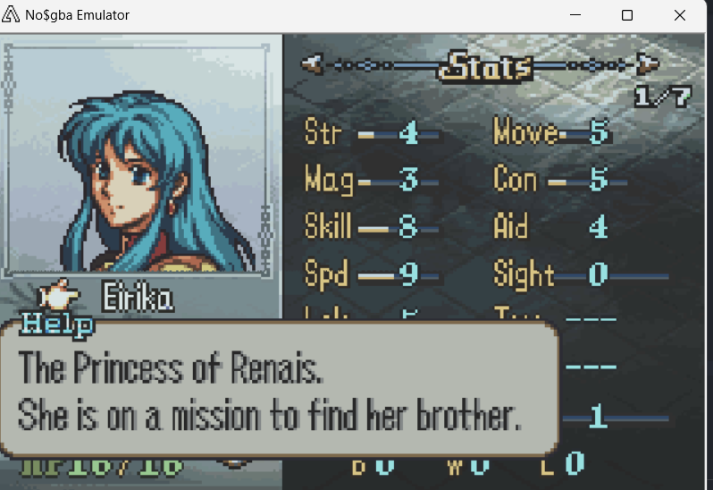
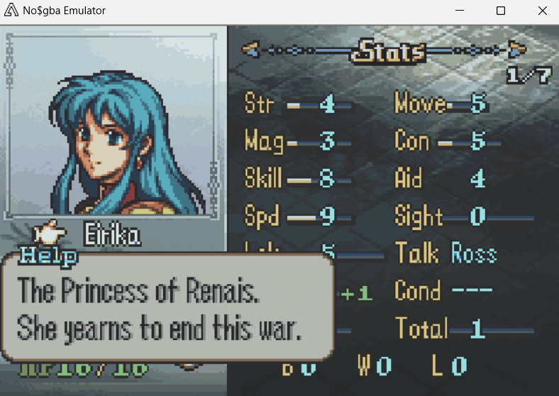
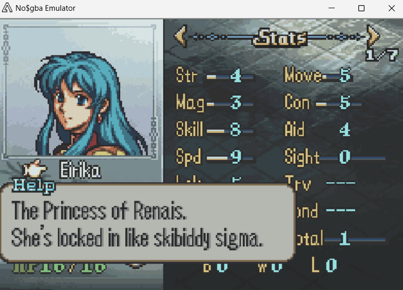

# Variable Character Descriptions

  
  
  

---

## 📑 Index
- [Introduction](#introduction)
- [Plan](#plan)
- [Code Locations](#code-locations)
- [TODO](#todo)
- [Limitations & Bugs](#limitations--bugs)

---

## 🧩 Introduction

``CONFIG_VARIABLE_UNIT_DESCRIPTIONS``

This feature allows unit descriptions to change to accomodate changes in events as the user dictates.
This can be used to give extra personalization to units, provide hints to upcoming story developments or just general flavor text.

This feature is still a work in progress, but a demo exists for changing the character description for Eirika based on the current chapter.
This can be extended to accomodate changes based on triggered flags, number of playable units etc etc.

---

## 🛠️ Plan

Each unit has up to 3 different character descriptions that can be swapped between depending on a variety of different parameters.

Ideally, a switch case would open in ``HbPopulate_SSCharacter`` based on the character's name and then depending on a variety of parameters
in each case, a different dialogue label from ``character_description_strings`` would be selected.

---

## 🗂️ Code Locations

| Feature | Location | Description |
|--------|----------|-------------|
| **Description quotes** | [`VariableCharacterDescriptions.txt`](../../Contents/Texts/Source/texts/FE8_Rewritten/VariableCharacterDescriptions.txt) | Holds all the text strings and labels for the character descriptions |
| **Description quote struct** | `character_description_strings` in [`MiscHooks.c`](../../Kernel/Wizardry/Common/Lvupfx/Lvupfx/MiscHooks.c) | The struct that we reference for the labels |
| **Description display logic** | `HbPopulate_SSCharacter` in [`MiscHooks.c`](../../Kernel/Wizardry/Common/Lvupfx/Lvupfx/MiscHooks.c) | Handles the description to display based on the parameters defined in the switch case |

---

## 📝 TODO

- Rearrange the switch case so that it's based on character ID and the cases based on the individual parameters
- Add remaining character descriptions labels.

---

## 🐛 Limitations & Bugs

Please report issues in the repository’s **Issues** tab.

- There is possibly some potential for lag if a lot of checks need to be performed. Look into it some more when the feature is more complete.

---
