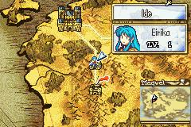

# World Map Skill Shop

  

---

## 📑 Index
- [Introduction](#introduction)
- [Plan](#plan)
- [Code Locations](#code-locations)
- [TODO](#todo)
- [Limitations & Bugs](#limitations--bugs)

---

## 🧩 Introduction

The world map skill shop adds a node-based skill purchasing flow to the world map menu. When the feature is enabled, the player can open a skill shop from supported world map nodes, browse node-specific skills, spend skill points, and return to the map with the unit state restored.

From a player perspective, the feature is meant to feel like a compact transaction screen:

- the shop only appears on nodes that are explicitly marked as skill shops
- the shop opens with the cursor on the first valid skill entry, then moves one slot at a time
- the list shows skill icons, names, costs, and the unit’s current SP total
- pressing `A` buys the selected skill if the unit can afford it and still has room to learn it
- pressing `R` opens the help box for the selected skill
- pressing `B` leaves the shop and returns to the world map

The implementation keeps the shop narrow in scope on purpose. It is a node-specific shop, not a global skill store, so the available inventory is controlled per location.

---

## 🛠️ Plan

The feature is built around a short lifecycle with clear state transitions.

| Stage | Player-facing behavior | Implementation notes |
|---|---|---|
| Availability | The Skill Shop menu entry appears only when the designer config enables SP engagement and the current node is a supported shop node. | `WMMenu_IsSkillShopAvailable` checks the runtime flag, node state, and node id lookup. |
| Entry | Selecting the menu item launches the shop proc from the world map menu. | `WMMenu_OnSkillShopSelected` stores the current menu selection and starts the shop proc. |
| Opening | The UI opens on the first valid skill entry and the visible list starts at the top. | `WorldMapSkillShop_Init` seeds the cursor and list position, and the cursor movement helper skips blank slots. |
| Browsing | The player can move up and down through the list one skill at a time, with help text available for the highlighted skill. | `WorldMapSkillShop_Loop`, `WorldMapSkillShop_MoveCursorToNextSkill`, `WorldMapSkillShop_ShowHelp`, and `WorldMapSkillShop_UpdateHandCursor` drive the interaction. |
| Purchase | `A` attempts to buy the highlighted skill and shows failure feedback for low SP, full skill lists, or duplicate skills. | `WorldMapSkillShop_TryPurchase` validates the unit, skill points, and skill capacity before calling `AddSkill`. |
| Exit | `B` cancels the shop and the world map state is restored on proc end. | `WorldMapSkillShop_OnEnd` restores the camera, unit id, and world map state. |

### Shop behavior summary

| Condition | Result |
|---|---|
| Current node is not a supported shop node | The Skill Shop option does not appear. |
| Feature flag is disabled | The Skill Shop option does not appear. |
| Cursor is on a valid skill | The name, icon, cost, and help text can be shown. |
| Unit already has the skill | The entry is shown as unavailable for purchase. |
| Unit has insufficient SP | Purchase fails with the no-funds dialogue. |
| Unit has no free skill slots | Purchase fails with the no-space dialogue. |
| Shop has 6 or more skills | The scroll bar is enabled for the list. |

### Current shop data

The current implementation hardcodes two supported nodes and their inventories:

| Node | Skills | Notes |
|---|---|---|
| IDE | Absolve, Astra, Fury, Counter | Short list; no scroll bar needed. |
| Serafew | Fury, Fury Plus, Fortress Def, Fortress Res, Blow Darting, Blow Death, Blow Armored | Long list; scroll bar is enabled. |

---

## 🗂️ Code Locations

| Feature | Location | Description |
|--------|----------|-------------|
| Menu availability gate | `WMMenu_IsSkillShopAvailable` in [Kernel/Wizardry/Misc/EnterTown/EnterTown.c](../../Kernel/Wizardry/Misc/EnterTown/EnterTown.c) | Enables the menu item only when SP engagement is active and the current node is a supported shop node. |
| Menu dispatch | `WMMenu_OnSkillShopSelected` in [Kernel/Wizardry/Misc/EnterTown/EnterTown.c](../../Kernel/Wizardry/Misc/EnterTown/EnterTown.c) | Transfers world map menu selection into the skill shop proc. |
| Shop node lookup | `WorldMapSkillShop_GetNodeIndex` and `WorldMapSkillShop_HasNodeShop` in [Kernel/Wizardry/Misc/EnterTown/WorldMap_SkillShop.c](../../Kernel/Wizardry/Misc/EnterTown/WorldMap_SkillShop.c) | Maps world map nodes to the supported shop inventory tables. |
| Proc setup and teardown | `WorldMapSkillShop_Init` and `WorldMapSkillShop_OnEnd` in [Kernel/Wizardry/Misc/EnterTown/WorldMap_SkillShop.c](../../Kernel/Wizardry/Misc/EnterTown/WorldMap_SkillShop.c) | Sets up the UI, stores world map state, and restores everything when the shop ends. |
| Cursor and scrolling behavior | `WorldMapSkillShop_MoveCursorToNextSkill` and `WorldMapSkillShop_ClampCursor` in [Kernel/Wizardry/Misc/EnterTown/WorldMap_SkillShop.c](../../Kernel/Wizardry/Misc/EnterTown/WorldMap_SkillShop.c) | Keeps the cursor on valid skill rows and maintains the top-of-list position. |
| List rendering | `WorldMapSkillShop_Draw` in [Kernel/Wizardry/Misc/EnterTown/WorldMap_SkillShop.c](../../Kernel/Wizardry/Misc/EnterTown/WorldMap_SkillShop.c) | Draws the frame, SP counter, skill rows, icons, costs, and text colors. |
| Help box and cursor hand | `WorldMapSkillShop_ShowHelp`, `WorldMapSkillShop_UpdateHandCursor`, and `WorldMapSkillShop_HandleEntryChoice` in [Kernel/Wizardry/Misc/EnterTown/WorldMap_SkillShop.c](../../Kernel/Wizardry/Misc/EnterTown/WorldMap_SkillShop.c) | Handles the contextual help box and the on-screen cursor hand. |
| Purchase flow | `WorldMapSkillShop_TryPurchase` and `WorldMapSkillShop_Loop` in [Kernel/Wizardry/Misc/EnterTown/WorldMap_SkillShop.c](../../Kernel/Wizardry/Misc/EnterTown/WorldMap_SkillShop.c) | Applies the buy check, feedback dialogue, and button handling for the shop. |

---

## 📝 TODO

- Add a data-driven table if more world map skill shop nodes are planned.
- Decide whether the shop should expose a stronger on-screen hint for the help button.
- Consider documenting the skill point economy alongside this shop so contributors can tune prices and rewards together.

---

## 🐛 Limitations & Bugs

- The implementation assumes the active world map unit and its BWL skill point record are valid when the shop opens.
- Blank array slots must stay zero-filled so the cursor movement code can safely skip them.

Please report any issues if the supported node list, inventory size, or exit flow needs to grow.