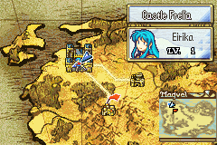

# World Map Thoughts

  

---

## 📑 Index
- [Introduction](#introduction)
- [Plan](#plan)
- [Code Locations](#code-locations)
- [TODO](#todo)
- [Limitations & Bugs](#limitations--bugs)

---

## 🧩 Introduction

World map thoughts are a small world map UI feature that lets a selected unit display chapter-specific thought bubbles on the map.

From a player perspective, the feature adds a lightweight narrative layer to the world map:

- specific units can show custom thought bubble graphics on certain chapters
- each thought bubble now uses one PNG per unit and chapter, but it still appears as two 64x64 pieces on the map
- the world map unit can be cycled with `R` when the feature is enabled
- pressing `A` on the selected node can center the camera on that unit's current map node when the selection matches the unit's location

The goal is to make the world map feel more reactive without changing the normal chapter flow.

---

## 🛠️ Plan

The feature is built around three pieces of behavior:

1. **Thought bubble graphics are mapped per unit and per chapter**
   - each supported unit has a chapter-indexed table of single bubble graphics
   - the world map UI reads those tables when the active unit changes
   - the selected graphic is decompressed once and copied into both 64x64 sprite slots so the visual layout stays unchanged

2. **Unit switching is handled directly from the world map UI**
   - when the feature is enabled, `R` cycles through the prep roster
   - the world map player interface is refreshed after switching units
   - this lets the player preview another supported unit without leaving the world map

3. **Camera centering only happens when the selected node matches the active unit's location**
   - the `A` button still goes through the normal node selection flow
   - camera centering is only allowed when the selected node is the same node the active unit currently occupies
   - this prevents the camera from snapping on unrelated node selections

### Behavior summary

| Condition | Result |
|---|---|
| Feature disabled | Normal world map behavior remains unchanged |
| `R` pressed with feature enabled | Active world map unit is switched to the next valid roster unit |
| `A` pressed on a node matching the active unit's location | Camera centers on that node |
| `A` pressed on a different node | Camera centering does not run |

### Adding new thoughts

To add a new thought bubble set for another unit or chapter:

- first create the bubble art as **64x64 graphics** using the **secondary icon palette** as a base; the existing character subfolders under [`Kernel/Wizardry/Misc/WorldMapThoughts`](../../Kernel/Wizardry/Misc/WorldMapThoughts) show the expected palette and can be copied as a template
- add the graphics as labels in [`WorldMapThoughts_Installer.event`](../../Kernel/Wizardry/Misc/WorldMapThoughts/WorldMapThoughts_Installer.event) and provide the image file paths there so the assets are generated and linked correctly
- once the labels exist, add the single graphics declarations in [`thought_bubbles.h`](../../include/jester_headers/thought_bubbles.h)
- add the new graphics references to the appropriate chapter table in [`WorldMapThoughts.c`](../../Kernel/Wizardry/Misc/WorldMapThoughts/WorldMapThoughts.c)
- extend `GetWorldMapThoughtBubbleForUnit` so the new unit returns the correct table
- keep the chapter indexing aligned with the world map chapter order used by the feature

If a unit does not have a bubble entry for a chapter, the array slot should remain empty so the feature can safely skip it.

---

## 🗂️ Code Locations

| Feature | Location | Description |
|--------|----------|-------------|
| World map thought bubble tables | `WorldMapThoughtBubbleEirika` / `WorldMapThoughtBubbleSeth` in [`WorldMapThoughts.c`](../../Kernel/Wizardry/Misc/WorldMapThoughts/WorldMapThoughts.c) | Chapter-indexed bubble graphics used by the UI |
| Bubble asset declarations | [`thought_bubbles.h`](../../include/jester_headers/thought_bubbles.h) | Declares the single bubble graphics symbols used by the feature |
| Bubble selection logic | `GetWorldMapThoughtBubbleForUnit` in [`WorldMapThoughts.c`](../../Kernel/Wizardry/Misc/WorldMapThoughts/WorldMapThoughts.c) | Chooses the active bubble table for the current unit |
| Bubble initialization | `WorldMapThoughtBubble_Init` in [`WorldMapThoughts.c`](../../Kernel/Wizardry/Misc/WorldMapThoughts/WorldMapThoughts.c) | Decompresses one bubble graphic and copies it into both VRAM sprite slots |
| Bubble rendering loop | `WorldMapThoughtBubble_Loop` in [`WorldMapThoughts.c`](../../Kernel/Wizardry/Misc/WorldMapThoughts/WorldMapThoughts.c) | Draws the bubble sprites while the proc is active |
| Unit switching | `GetNextWorldMapRosterUnitId` and the `R_BUTTON` branch in [`WorldMapThoughts.c`](../../Kernel/Wizardry/Misc/WorldMapThoughts/WorldMapThoughts.c) | Cycles the active world map unit through the roster |
| Camera centering | `WorldMap_CenterCamera` in [`WorldMapThoughts.c`](../../Kernel/Wizardry/Misc/WorldMapThoughts/WorldMapThoughts.c) | Centers the map camera when the selected node matches the unit's current location |

---

## 📝 TODO

- Review whether the feature should expose a clearer on-screen hint for the `R` unit switch.

---

## 🐛 Limitations & Bugs

- The feature currently relies on the existing world map node and roster data already being valid.

Please report any issues if the chapter order or unit table needs to be extended.