# FE8U C-SkillSystem

This is a modern C based buildfile for FE8U.

This has been heavily modified from the [master buildfile](https://github.com/MokhaLeee/fe8u-cskillsys-kernel/) to accomodate a wide range of features below.

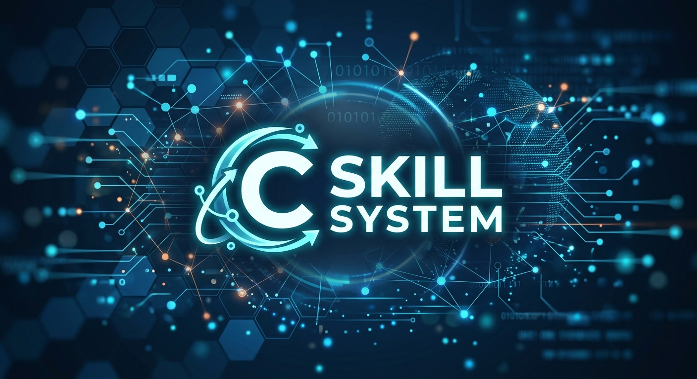

### - [Setup Guide](./Documentation/Setup.md)
### - [How to contribute](./Documentation/CONTRIBUTING.md)
### - [Community Discussion on FEUniverse](https://feuniverse.us/t/fe8-modern-c-skillsystem-release/24614)
### - [Runtime configuration source](./Data/DesignerConfig/designer-config.c)

## Features

<!-- markdownlint-disable MD033 -->

- [AI Rescue Retreat](./Documentation/Features/AIRescueRetreat.md)

	

		
Preview

		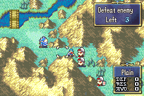
	

- [Anima Triangle](./Documentation/Features/AnimaTriangle.md)

	

		
Preview

		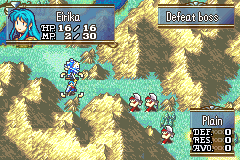
	

- [Arena Roster](./Documentation/Features/ArenaRoster.md)

	

		
Preview

		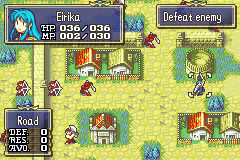
	

- [Augury Menu](./Documentation/Features/AuguryMenu.md)

	

		
Preview

		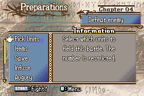
	

- [Banim Features](./Documentation/Features/BanimFeatures.md)
- [Base Chapters](./Documentation/Features/BaseChapters.md)

	

		
Preview

		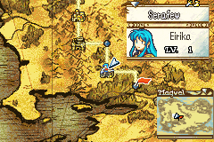
	

- [Base Conversations Menu](./Documentation/Features/BaseConversationsMenu.md)

	

		
Preview

		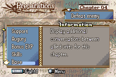
	

- [Battle System](./Documentation/Features/BattleSystem.md)
- [Biorhythm](./Documentation/Features/Biorhythm.md)
- [Bonus EXP Menu](./Documentation/Features/BonusEXPMenu.md)

	

		
Preview

		
	

- [Character Biographies](./Documentation/Features/CharacterBiographies.md)

	

		
Preview

		
	

- [Combat Art](./Documentation/Features/CombatArt.md)
- [Conversation Viewer](./Documentation/Features/ConversationViewer.txt)

	

		
Preview

		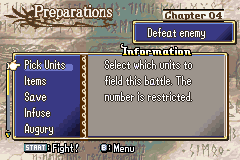
	

- [Credits Feature](./Documentation/Features/Credits.md)
- [Custom Battle Quotes](./Documentation/Features/CustomBattleQuotes.md)
- [Custom Defeat Quotes](./Documentation/Features/CustomDefeatQuotes.md)

	

		
Preview

		
	

- [Debuff](./Documentation/Features/Debuff.md)
- [Enemies Promote When Killing Unit](./Documentation/Features/EnemiesPromoteWhenKillingUnit.md)

	

		
Preview

		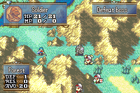
	

- [Expanded HP](./Documentation/Features/ExpandedHP.md)

	

		
Preview

		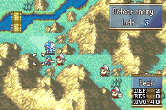
	

- [FE7 Fancy Teleport](./Documentation/Features/FE7FancyTeleport.md)

	

		
Preview

		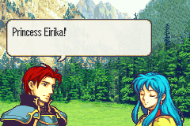
	

- [Fog Stages](./Documentation/Features/FogStages.md)

	

		
Preview

		
	

- [Fog Vision](./Documentation/Features/FogVision.md)
- [Free Movement](./Documentation/Features/FreeMovement.md)
- [Gaiden Magic](./Documentation/Features/GaidenMagic.md)
- [Halfbodies](./Documentation/Features/Halfbodies.md)
- [How To Make A Chapter](./Documentation/Features/HowToMakeAChapter.md)
- [Infuse Menu](./Documentation/Features/InfuseMenu.md)

	

		
Preview

		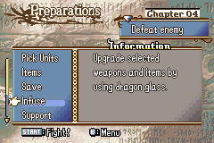
	

- [Item System](./Documentation/Features/ItemSys.md)
- [Kill Rewards](./Documentation/Features/KillRewards.md)
- [Konami Code](./Documentation/Features/KonamiCode.md)
- [Laguz Bars](./Documentation/Features/LaguzBars.md)

	

		
Preview

		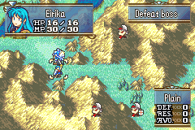
	

- [Level Up Quotes](./Documentation/Features/LevelUpQuotes.md)

	

		
Preview

		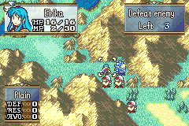
	

- [Limited Shop Stock](./Documentation/Features/LimitedShopStock.md)

	

		
Preview

		
	

- [Max Color Backgrounds](./Documentation/Features/MaxColorBackgrounds.md)
- [Menu Options](./Documentation/Features/MenuOptions.md)
- [Menu Skill AI](./Documentation/Features/MenuSkillAI.md)

	

		
Preview

		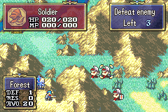
	

- [Misc Skill Effects](./Documentation/Features/MiscSkillEffect.md)
- [Modular Staff EXP](./Documentation/Features/ModularStaffEXP.md)
- [MP System](./Documentation/Features/MpSystem.md)

	

		
Preview

		
	

- [Overview](./Documentation/Features/Abstract.md)
- [Popup System](./Documentation/Features/PopupR.md)
- [Quality Of Life](./Documentation/Features/QualityOfLife.md)
- [Save System](./Documentation/Features/Save.md)
- [Shield Item](./Documentation/Features/ShieldItem.md)
- [Skill Icon Palettes](./Documentation/Features/SkillIconPalettes.md)
- [Skill System](./Documentation/Features/SkillSys.md)
- [Skills Glossary](./Documentation/Features/SkillInfo.md)
- [Start Map Effects](./Documentation/Features/StartMapEffects.md)
- [Stat Screen Promotions](./Documentation/Features/StatScreenPromotions.md)

	

		
Preview

		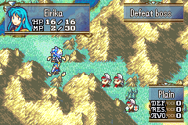
	

- [System Config](./Documentation/Features/SystemConfig.md)
- [Tellius Skill Capacity](./Documentation/Features/TelliusSkillCapacity.md)

	

		
Preview

		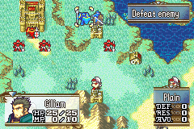
	

- [Text Engine Rework](./Documentation/Features/TextEngineRework.txt)

	

		
Preview

		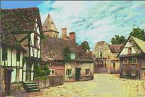
	

- [Tonics](./Documentation/Features/Tonics.md)

	

		
Preview

		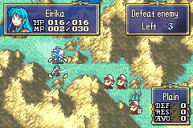
	

- [Trap Rework](./Documentation/Features/TrapRework.md)
- [Unit Selection Quotes](./Documentation/Features/UnitSelectionQuotes.md)
- [Unlimited Prep Menu Options](./Documentation/Features/UnlimitedPrepMenuOptions.md)

	

		
Preview

		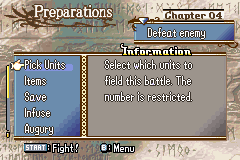
	

- [Variable Character Descriptions](./Documentation/Features/VariableCharacterDescriptions.md)
- [Voice Acted Intros](./Documentation/Features/VoiceActedIntros.md)
- [Wizardry](./Documentation/Features/Wizardry.md)
- [World Map Thoughts](./Documentation/Features/WorldMapThoughts.md)

	

		
Preview

		
	

<!-- markdownlint-enable MD033 -->
