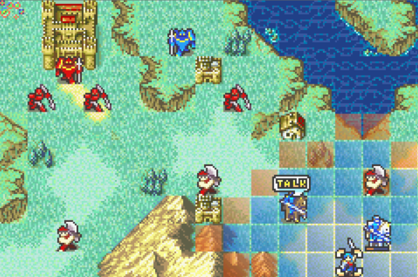

# Custom Talk Icon

<p align="center">
  
</p>

Shows a Lex Talionus-style talk icon above the conversation partner while a unit is selected and a talk or support is available.

When a player unit is selected, the patch finds the current talkee (character talk event or available support) and draws a two-part 32x8 OBJ icon above that unit. Vanilla FE8U does not draw map talk icons in `PutUnitSpriteIconsOam`; this patch adds them without replacing other vanilla icon behavior.

Icon art is by Alice (from the integrated C Skill System campaign).

## Target ROM

- **FE8U (USA)** clean ROM
- Hook: vanilla `PutUnitSpriteIconsOam` at `0x080275E9`
- Graphics: `LoadObjUIGfx` pointer at `$156AC`, sheet width at `$15690`
- Free space: `$1000000`

## Build

No build step is required to install the patch. `Source/CustomTalkIcon.lyn.event` is checked in, so you can install `Installer.event` as-is.

Run `make` only if you edit `Source/CustomTalkIcon.c`:

```bash
make -C Standalone/custom_talk_icon
```

That requires [devkitARM](https://devkitpro.org/wiki/Getting_Started) and this repo's [FE-CLib](https://github.com/MokhaLeee/FE-CLib-Mokha) / [Event Assembler](https://github.com/MokhaLeee/EventAssembler/tree/mokha-fix) tools. See [Documentation/Setup.md](../../Documentation/Setup.md) for full setup.

## Installation

### FEBuilderGBA

1. Download [FEBuilderGBA (Laqieer branch)](https://nightly.link/laqieer/FEBuilderGBA/workflows/msbuild/master).
2. In **Settings → Options → Path**, set **Event Assembler** to this repo's [ColorzCore](https://github.com/MokhaLeee/EventAssembler/tree/mokha-fix) executable (see [Setup.md](../../Documentation/Setup.md)).
3. Open your project ROM in FEBuilder.
4. Go to **Advanced Editors → Insert EA**.
5. Click **Select File**, choose `Standalone/custom_talk_icon/Installer.event`, then click **Load Script**.

### Event Assembler

From a copy of clean `fe8.gba`:

```bash
cp /path/to/fe8.gba /path/to/fe8-talk-icon.gba
Tools/EventAssembler/ColorzCore A FE8 \
  -input:Standalone/custom_talk_icon/Installer.event \
  -output:/path/to/fe8-talk-icon.gba
```

Run from the repository root so Event Assembler can resolve `EAstdlib.event`.

## Files

| File | Purpose |
|------|---------|
| `Installer.event` | EA installer, hook, free-space placement, and graphics patch |
| `Gfx.event` | Replaces `LoadObjUIGfx` sheet with talk icon tiles |
| `Gfx/WarningHpSheet_Jester.png` | Source art for OBJ UI sheet |
| `Source/CustomTalkIcon.c` | C implementation |
| `Source/CustomTalkIcon.lyn.event` | Checked-in lyn output (rebuild with `make` after editing `.c`) |
| `makefile` | Compiles C to `.lyn.event` |

## Conflicts

- Any patch that replaces vanilla `PutUnitSpriteIconsOam` (`0x080275E9`), including the full C Skill System MapTask rewrite.
- Any patch that changes `LoadObjUIGfx` graphics at `$156AC` / `$15690` (for example HP bar or other OBJ UI sheet hacks).
- Free space at `$1000000` overlaps with other standalone patches from this repo. Install only one body at `$1000000`, or move this patch's `ORG` to the next free region after any already-installed standalone code.

`Installer.event` uses `PROTECT` on the hook site, `LoadObjUIGfx` edits, and the free-space body. Overlapping patches should fail assembly with a clear EA error.

## Credits

Extracted from [C Skill System](https://github.com/JesterWizard/C-SkillSystem-Jester). Talk icon by Alice.
