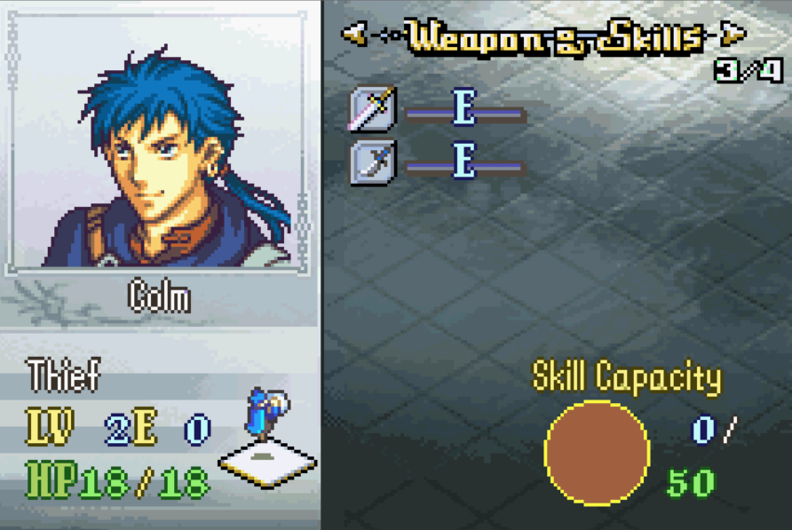
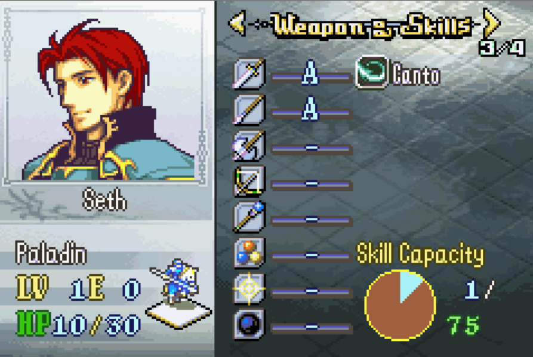

# Dynamic Weapon Slots

<p align="center">
  
  
</p>

## Index
- [Introduction](#introduction)
- [Install](#install)
- [Configuration](#configuration)
- [Hooks & Free Space](#hooks--free-space)
- [Conflicts](#conflicts)
- [Limitations](#limitations)

---

## Introduction

Vanilla FE8 stores weapon EXP in a fixed eight-byte array on every unit, indexed by global weapon type (`sword=0` … `dark=7`). This patch keeps those eight physical `Unit::ranks` bytes unchanged but lets each class assign which weapon types use those slots. A thief can keep swords in slot 0 and put knives in slot 1 without affecting other classes.

Classes absent from the override table keep the vanilla identity mapping (slot `N` ↔ weapon type `N`).

---

## Install

1. Build the C sources (optional if `Source/DynamicWeaponSlots.lyn.event` is already present):

   ```bash
   cd Standalone/dynamic_weapon_slots
   make
   ```

2. In FEBuilder, add `Standalone/dynamic_weapon_slots/Installer.event` to your build.

Target ROM: **clean FE8U (USA)**.

---

## Configuration

Edit `ClassWeaponSlotConf.event` and add sparse per-class entries:

```
DWS_ClassWeaponSlotConf(DWS_CLASS_THIEF,
    DWS_ITYPE_SWORD, DWS_ITYPE_KNIFE, DWS_SLOT_NONE, DWS_SLOT_NONE,
    DWS_SLOT_NONE, DWS_SLOT_NONE, DWS_SLOT_NONE, DWS_SLOT_NONE,
    0, DWS_WPN_EXP_E, 0, 0, 0, 0, 0, 0)
```

The eight weapon-type bytes are physical slots `0`–`7`. The eight base-rank bytes are optional starting WEXP overrides indexed by **physical slot** (`0` falls back to `ClassData`).

No C rebuild is needed after editing the event table.

Custom weapon types (`ITYPE_KNIFE`, `ITYPE_GUN`, etc.) also need matching item data, weapon-type icons, and help text in your project. This patch only handles rank-slot remapping.

---

## Hooks & Free Space

| Function | Hook (`ORG`) | Overwritten |
|----------|--------------|-------------|
| `CanUnitUseWeapon` | `$16574` | 8 bytes |
| `UnitLoadStatsFromChracter` | `$17E34` | 8 bytes |
| `CanClassWieldWeaponType` | `$17A8C` | 8 bytes |
| `ApplyUnitPromotion` | `$2BD50` | 8 bytes |
| `GetBattleUnitUpdatedWeaponExp` | `$2C0B4` | 8 bytes |
| `HasBattleUnitGainedWeaponLevel` | `$2C1B0` | 8 bytes |
| `UpdateUnitFromBattle` | `$2C1EC` | 8 bytes |
| `UpdateUnitDuringBattle` | `$2C2D4` | 8 bytes |
| `GetUnitBestWRankType` | `$318B4` | 8 bytes |
| `DisplayWeaponExp` | `$87788` | 8 bytes |
| `DisplayPage2` | `$8784C` | 8 bytes |

**Free space:** `$1000000` (body continues at `CURRENTOFFSET` after install).

---

## Conflicts

- Any patch that hooks the same vanilla functions listed above.
- Skill System integrated `weapon-slots` / `dynamic_weapon_slots` (do not install both).
- Custom stat-screen overhauls that replace `DisplayPage2` or `DisplayWeaponExp`.
- Reclass systems that remap WEXP with their own logic (e.g. Vesly Reclass) unless adapted to call `RemapUnitWeaponRanksOnClassChange`.

---

## Limitations

- Still limited to **eight simultaneous** rank-bearing types per class.
- Changing a class table entry does not rewrite units already loaded in a save; reload the chapter or recreate the unit.
- Custom types above vanilla index 10 need their own icons and display strings; stat screen uses vanilla icon IDs (`0x70 + wtype`).
- Example table enables knives for the thief line only; extend `ClassWeaponSlotConf.event` for your classes.

---
