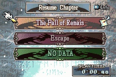

# Game Over Quotes

<p align="center">
  
</p>

Replaces the vanilla **GAME OVER** graphic with a random three-line tip on the foggy defeat screen. One quote is chosen with `NextRN_N` each time the game-over screen starts.

Default tips mention Skill System mechanics (skill capacity, 2RN, skill scrolls). Edit `GameOverQuotes.event` for vanilla FE8 or a custom hack.

## Target ROM

- **FE8U (USA)** clean ROM
- Hook: vanilla `GameOverScreen_Init` at `0x080212C0` (Thumb entry `0x080212C1`)
- Free space: `$1000000`

## Configuration

Edit `GameOverQuotes.event` without recompiling C. Each quote is three ASCII lines drawn in gold and centered. Unused lines can point at `GameOverQuoteEmpty`. Append more `GameOverQuote(...)` rows before `GameOverQuotesEnd`.

The first default tip is split into three lines (the integrated C source concatenated the title with the flier line).

## Build

No build step is required to install the patch. `Source/GameOverQuotes.lyn.event` is checked in, so you can install `Installer.event` as-is.

Run `make` only if you edit `Source/GameOverQuotes.c`:

```bash
make -C Standalone/gameover_quotes
```

That requires [devkitARM](https://devkitpro.org/wiki/Getting_Started) and this repo's [FE-CLib](https://github.com/MokhaLeee/FE-CLib-Mokha) / [Event Assembler](https://github.com/MokhaLeee/EventAssembler/tree/mokha-fix) tools. See [Documentation/Setup.md](../../Documentation/Setup.md) for full setup.

Table-only edits in `GameOverQuotes.event` do not need `make`.

## Installation

This folder is self-contained. It does not include `EAstdlib.event` or `Hack Installation.txt`. FEBuilder’s bundled Event Assembler is enough.

### FEBuilderGBA

1. Copy the `gameover_quotes` folder (or download this standalone package).
2. Open a clean FE8U ROM in FEBuilder.
3. Go to **Advanced Editors → Insert EA**.
4. Click **Select File**, choose `Installer.event`, then click **Load Script**.

### Event Assembler

From a copy of clean `fe8.gba`, with this folder as the working directory:

```bash
ColorzCore A FE8 -input:Installer.event -output:/path/to/fe8-gameover-quotes.gba
```

## Files

| File | Purpose |
|------|---------|
| `Installer.event` | EA installer, addresses, hook, and free-space placement |
| `GameOverQuotes.event` | Quote strings and pointer table (edit without compiling C) |
| `Source/GameOverQuotes.c` | C implementation |
| `Source/GameOverQuotes.lyn.event` | Checked-in lyn output (rebuild with `make` after editing `.c`) |
| `makefile` | Compiles C to `.lyn.event` |

## Conflicts

- Any patch that replaces vanilla `GameOverScreen_Init` (`0x080212C0` / `0x080212C1`), including the full C Skill System GameOver rewrite.
- Installing on a ROM that already modified the first 8 bytes at `0x080212C0`.
- Free space at `$1000000` overlaps with other standalone patches from this repo. Install only one body at `$1000000`, or move this patch's `ORG` after any already-installed standalone code.
- Do not install this on a ROM that already has the C Skill System kernel with `gameover_quotes` enabled.

`Installer.event` uses `PROTECT` on both the hook site (`$212C0`, 8 bytes) and the free-space body (`$1000000` through end of the quote table). If another patch overlaps those ranges, Event Assembler should report the conflicting write location.

## Credits

Extracted from [C Skill System](https://github.com/JesterWizard/C-SkillSystem-Jester).
