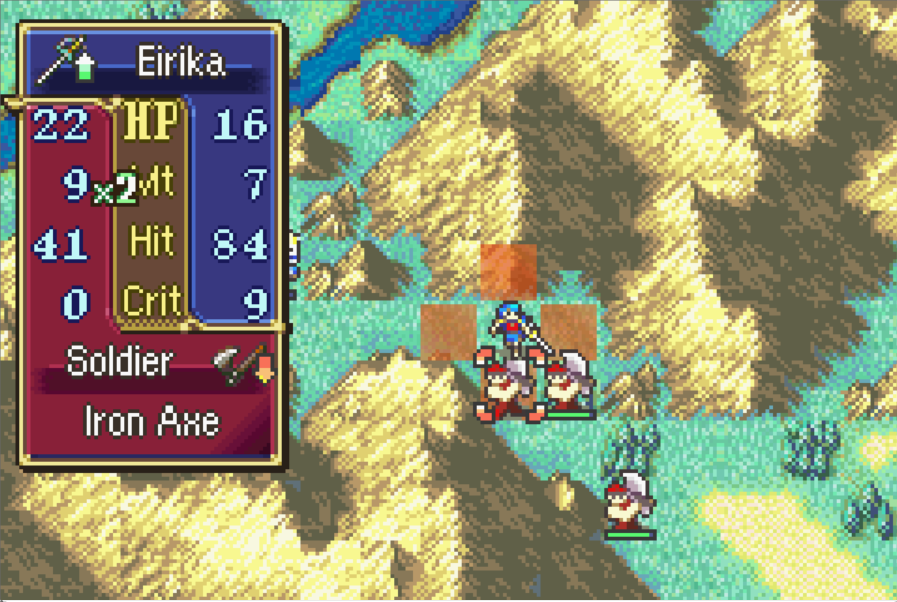
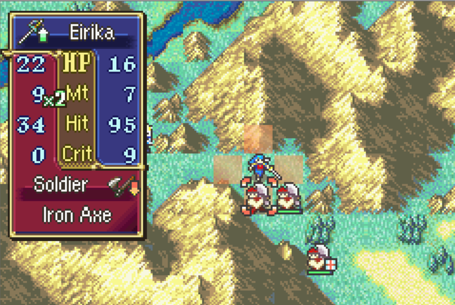

# Show True 2RN

<p align="center">
  
  
</p>

Combat still uses vanilla **2RN**, but displayed HIT is converted to the real success chance.

A listed 70 Hit is closer to an 80% chance to connect. This patch shows that true percentage on:

- The standard and detailed battle forecast
- The battle-animation HIT numbers

Combat rolls are unchanged. Only the number the player sees is remapped.

Examples (displayed → true):

| Vanilla HIT | True 2RN |
|-------------|----------|
| 0–4 | 0 |
| 50 | 51 |
| 70 | 80 |
| 90 | 98 |
| 95–100 | 100 |

Values match [Serenes Forest](https://serenesforest.net/general/true-hit/), rounded to the nearest percent. This matches the integrated C Skill System `show_true_2rn` display table, but installs on **clean FE8U** without the kernel.

Unlike the full Skill System, there is no Options-menu toggle. The patch is on whenever `SHOW_TRUE_2RN` is `1`.

## Configuration

Edit `SHOW_TRUE_2RN` at the top of `Installer.event`, then reinstall the patch. No C recompile is needed.

| Constant | Default | Meaning |
|----------|---------|---------|
| `SHOW_TRUE_2RN` | `1` | Set to `0` to keep vanilla displayed hit |

## Target ROM

- **FE8U (USA)** clean ROM
- Hooks:
  - vanilla `DrawBattleForecastContentsStandard` at `0x08036818` (Thumb entry `0x08036819`)
  - vanilla `DrawBattleForecastContentsExtended` at `0x08036A70` (Thumb entry `0x08036A71`)
  - vanilla `NewEkrGauge` at `0x08050EF8` (Thumb entry `0x08050EF9`)
- Free space: `$1000000`

## Build

No build step is required to install the patch. `Source/ShowTrue2RN.lyn.event` is checked in, so you can install `Installer.event` as-is.

Run `make` only if you edit `Source/ShowTrue2RN.c`:

```bash
make -C Standalone/show_true_2rn
```

That requires [devkitARM](https://devkitpro.org/wiki/Getting_Started) and this repo's [FE-CLib](https://github.com/MokhaLeee/FE-CLib-Mokha) / [Event Assembler](https://github.com/MokhaLeee/EventAssembler/tree/mokha-fix) tools. See [Documentation/Setup.md](../../Documentation/Setup.md) for full setup.

## Installation

This folder is self-contained. It does not include `EAstdlib.event` or `Hack Installation.txt`. FEBuilder’s bundled Event Assembler is enough.

### FEBuilderGBA

1. Copy the `show_true_2rn` folder (or download this standalone package).
2. Open a clean FE8U ROM in FEBuilder.
3. Go to **Advanced Editors → Insert EA**.
4. Click **Select File**, choose `Installer.event`, then click **Load Script**.

### Event Assembler

From a copy of clean `fe8.gba`, with this folder as the working directory:

```bash
ColorzCore A FE8 -input:Installer.event -output:/path/to/fe8-true-2rn.gba
```

## Files

| File | Purpose |
|------|---------|
| `Installer.event` | EA installer, addresses, hooks, enable flag, and free-space placement |
| `Source/ShowTrue2RN.c` | C implementation |
| `Source/ShowTrue2RN.lyn.event` | Checked-in lyn output (rebuild with `make` after editing `.c`) |
| `makefile` | Compiles C to `.lyn.event` |

## Conflicts

- Any patch that replaces vanilla `DrawBattleForecastContentsStandard` (`0x08036818`), `DrawBattleForecastContentsExtended` (`0x08036A70`), or `NewEkrGauge` (`0x08050EF8`), including the full C Skill System battle forecast / HP-bar rewrite or the `expanded_hp` standalone.
- Free space at `$1000000` overlaps with other standalone patches from this repo. Install only one body at `$1000000`, or move this patch's `ORG` to the next free region after any already-installed standalone code.

`Installer.event` uses `PROTECT` on each hook site (8 bytes) and the free-space body (`$1000000` through end of install). If another patch overlaps those ranges, Event Assembler should report the conflicting write location.

## Credits

Extracted from [C Skill System](https://github.com/JesterWizard/C-SkillSystem-Jester).
