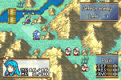

# Bonus EXP

  

---

## 📑 Index
- [Introduction](#introduction)
- [Plan](#plan)
- [Code Locations](#code-locations)
- [TODO](#todo)
- [Limitations & Bugs](#limitations--bugs)

---

## 🧩 Introduction

This feature introduces a psuedo implementation of FE9's famous bonus experience feature, wherein all units who participate in a map get bonus experience

---

## 🛠️ Plan

For this implementation, the aim is to ensure:

- All units who participate (and are alive at the end) get bonus experience
- The entire implementation can be called via two event commands (exp amount and then the BEXP proc)
- That experience is variable and can be set in an event slot
- The EXP bar is shown for each unit
- Units can level up when they gain BEXP

What you want to do in the end event of your chapter is to call these two event instructions.

``
SVAL(EVT_SLOT_7, 10)
``

``
ASMC(GrantBEXP)
``

Set the `10` to whatever value you want between 0-254 for EXP (I expanded it from 100)

---

## 🗂️ Code Locations

| Feature | Location | Description |
|--------|----------|-------------|
| **Initial called function** | `GrantBEXP` in [`MiscFunctions`](../../Kernel//Wizardry/Misc/MiscFunctions/MiscFunctions.event) | The initial function called by the ASMC, sets the starting unit index |
| **Event logic** | `ProcScr_GrantBEXP` in  [`MiscFunctions`](../../Kernel//Wizardry/Misc/MiscFunctions/MiscFunctions.event) | Enables the event to loop through every unit |
| **Unit looping function** | ` GrantBEXP_Loop`  [`MiscFunctions`](../../Kernel//Wizardry/Misc/MiscFunctions/MiscFunctions.event) | The implementation details of the unit loop |

---

## 📝 TODO

- Create a global value that holds a repository of BEXP (probably a short)
- Create a menu in preps that can access this repository and level up each unit individually
- BEXP to gain a level will scale linearly with the unit's current level
- Toggle a feature to ensure minimum stat gains from BEXP

---

## 🐛 Limitations & Bugs

Please report issues in the repository’s **Issues** tab.

---
