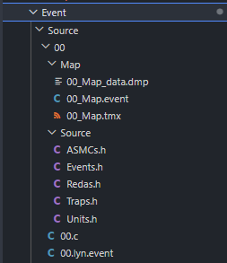
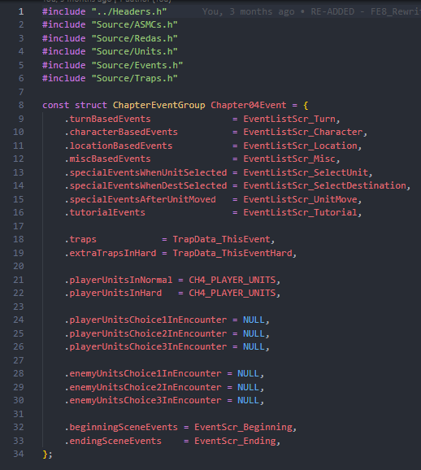
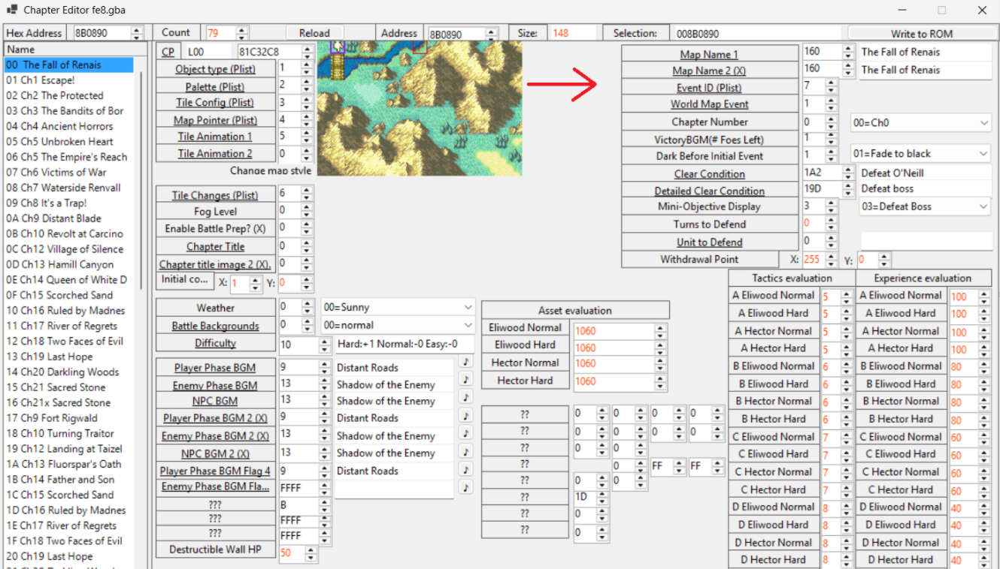
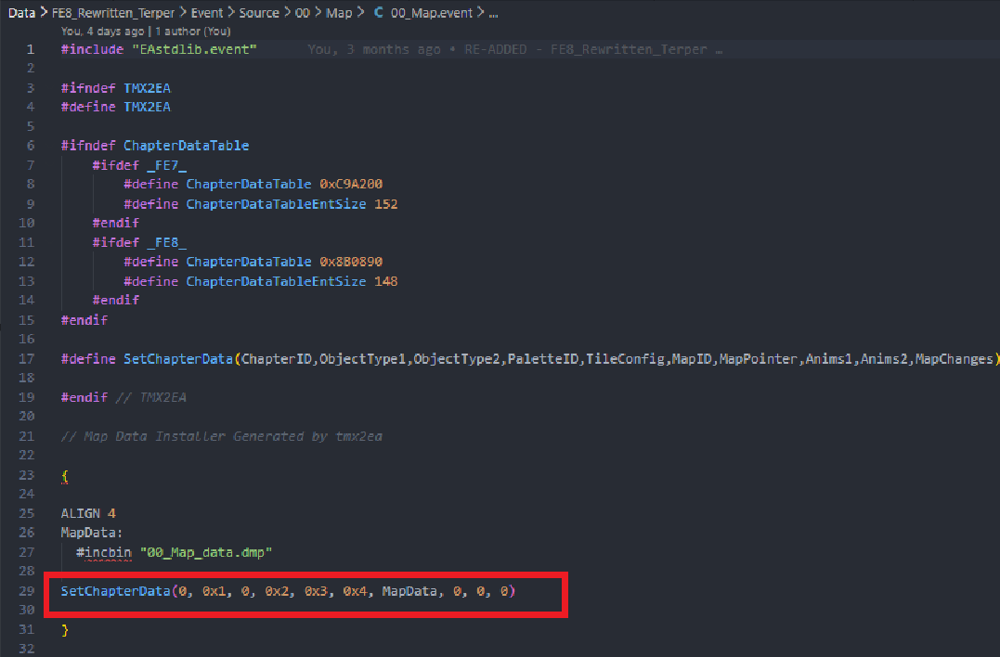

# How to make a chapter

---

## 📑 Index
- [Introduction](#introduction)
- [Tools](#tools)
- [Steps](#steps)
- [Misc](#misc)
- [Limitations](#limitations)

---

## 🧩 Introduction

In order to make the most out of the C skill system in this buildfile, you'll need to know how to replace the existing chapters and use your own events in them. I'll help you do that below.

---

## 🛠️ Tools

You will need the following:

- FEBuilder (to reference vanilla map structures for PList settings etc)
- A tool to export PNG maps as TMX files (FEBuilder does this)
- TMX2EA turns TMX map files into something that can be inserted into the ROM via Event Assembler

---

## 🗂️ Steps

Chapters come in two parts, the actual chapter settings and its events. We'll cover both below.

### Events

1) Export your map as TMX file using your tool of choice
2) Drag and drop it onto a copy of TMX2EA to produce ``.event`` and ``.dmp`` files for your map
3) Put the outputs in the [`Event/Source`](../../Data/FE8_Rewritten_Terper/Event/Source) folder, taking care to note the structure from the demo chapter.
  - Make a seperate folder in that location for your events
  - Make two folders inside it, one for your maps and one called `Source` for your events 
  - Inside ``Source`` Make 5 headers files for the individual components of your events like in the image below
  - Then in the root of your ``Event`` folder make a copy of the demo chapter, and change the name from Chapter04Event in the screenshot below to whatever your chapter is
  - Keep in mind the ``.playerUnits`` fields. Set them to NULL if you're not using the prep screen in the chapter, otherwise they will need to be set to a unit struct name (more on that later)




4) Inside the [`Event.event`](../../Data/FE8_Rewritten_Terper//Event/Event.event) folder, you'll want to make an entry for your chapter.

This is the basic structure:

```
EventPointerTable(0x7, Chapter00Event)
#include "Source/00/00.lyn.event"
#include "Source/00/Map/00_Map.event"
```

The first parameter in ``EventPointerTable`` will be the event ID of the chapter you're replacing in FEBuilder. You can find it in the chapter editor in the screenshot below.
You will also include the events file and your map event here.



5) Inside your map event file, you will need to make some edits to the ``SetChapterData`` function. Now I've only made small edits to the vanilla map, so I'm not sure how much of this is viable for custom maps, but what I did here was look at the chapter I was replacing in FEBuilder in the chapter editor above and then copied over the required values. Some of these may need to change if using custom maps and tilesets, I'm not 100% sure.



When it comes to actually adding events, I do all of it in C. So my advice will be geared towards making events in C just like the vanilla game was. Keep that in mind before proceeding.

6) Inside the Source folder, you will see see 5 header files, each responsible for a different part of events.

- ``ASMC.h`` controls the use of custom functions in our events. ASMC itself is just short for Assembly Code. It lets us write code to dictate events to microscopic detail outside of what norma event commands can offer, like changing a unit's inventory or the weather when certain conditions are met. 
- ``Events.h`` - This is where the bulk of your effort will go. In here is where we control the events before and after the chapter starts, unit deployments, traps, talk conversations etc all happen here.
- ``Redas.h`` - **RE**inforcement **Da**ta. This controls how deployed units behave after they are loaded onto the map. Mainly used to control their movement patterns. Like making a unit race to another side of the map.
- ``Traps.h`` - Used to control the placement of traps on a map, like fire tiles or light arrows. Rarely used be default
- ``Units.h`` - This is where unit groups are loaded, with their name, class, inventories and AI behaviour

# ``TO BE CONTINUED``


### Chapter

1) Now we need to create the chapter outputs inside the [`Chapter/Source`](../../Data/FE8_Rewritten_Terper/Chapter/Source/) folder. Create a folder in there for your chapter.

# ``TO BE CONTINUED``

---

## 🤖 Misc

These are the code locations for the vanilla maps

- Prologue - ``0x88B0890``
- Chapter 1 - ``0x88B0924``
- Chapter 2 - ``0x88B09B8``
- Chapter 3 - ``0x88B0A4C``
- Chapter 4 - ``0x88B0AE0``
- Chapter 5 - ``0x88B0B74``
- Chapter 5x - ``0x88B0C08``
- Chapter 6 - ``0x88B0C9C``
- Chapter 7 - ``0x88B0D30``
- Chapter 8 - ``0x88B0DC4``
- Chapter 9 - Eirika - ``0x88B0E58``
- Chapter 9 - Ephraim - ``0x88B15DC``
- Chapter 10 - Eirika - ``0x88B0EEC``
- Chapter 10 - Ephraim - ``0x88B1670``
- Chapter 11 - Eirika - ``0x88B2BD4``
- Chapter 11 - Ephraim - ``0x88B2C68``
- Chapter 12 - Eirika - ``0x88B0F80``
- Chapter 12 - Ephraim - ``0x88B1704``
- Chapter 13 - Eirika - ``0x88B1014``
- Chapter 13 - Ephraim - ``0x88B1798``
- Chapter 14 - Eirika - ``0x88B10A8``
- Chapter 14 - Ephraim - ``0x88
- Chapter 15 - Eirika - ``0x88B113C``
- Chapter 15 - Ephraim - ``0x88B18C0
- Chapter 16 - Eirika - ``0x88B11D0``
- Chapter 16 - Ephraim - ``0x88B1954``
- Chapter 17 - Eirika - ``0x88B1264``
- Chapter 17 - Ephraim - ``0x88B19E8``
- Chapter 18 - Eirika - ``0x88B12F8``
- Chapter 18 - Ephraim - ``0x88B1A7C``
- Chapter 19 - Eirika - ``0x88B138C``
- Chapter 19 - Ephraim - ``0x88B1B10``
- Chapter 20 - Eirika - ``0x88B1420``
- Chapter 20 - Ephraim - ``0x88B1BA4`
- Chapter 21 - Eirika - ``0x88B14B4``
- Chapter 21 - Ephraim - ``0x88B1C38``
- Chapter 21x - Eirika - ``0x88B1548``
- Chapter 21x - Ephraim - ``0x88B1CCC1``
- Tower of Valni 1 - ``0x88B1D60``
- Tower of Valni 2 - ``0x88B1DF4``
- Tower of Valni 3 - ``0x88B1E88``
- Tower of Valni 4 - ``0x88B1F1C``
- Tower of Valni 5 - ``0x88B1FB0``
- Tower of Valni 6 - ``0x88B2044``
- Tower of Valni 7 - ``0x88B20D8``
- Tower of Valni 8 - ``0x88B216C``
- Lagdou Ruins 1 - ``0x88B2328``
- Lagdou Ruins 2 - ``0x88B23BC``
- Lagdou Ruins 3 - ``0x88B2450``
- Lagdou Ruins 4 - ``0x88B24E4``
- Lagdou Ruins 5 - ``0x88B2578``
- Lagdou Ruins 6 - ``0x88B260C``
- Lagdou Ruins 7 - ``0x88B26A0``
- Lagdou Ruins 8 - ``0x88B2734``
- Lagdou Ruins 9 - ``0x88B27C8``
- Lagdou Ruins 10 - ``0x88B285C``
- Melkaen Coast - ``0x88B2984``
- Castle Frelia - ``0x88B28F0``
- Tower of Valni 8 - Cutscene 1 - ``0x88B2200``
- Tower of Valni 8 - Cutscene 2 - ``0x88B2294``
- Link Arena - ``0x88B2A18``
- Debug Map 1 - ``0x88B2AAC``
- Debug Map 2 - ``0x88B2B40``
- Outside Grado Castle - ``0x88B2CFC``
- Outside Renais Castle - ``0x88B2D90``
- Caer Pelyn Route - ``0x88B2E24``
- Inside Renais throneroom - ``0x88B2EB8``
- Inside Renais balcony - ``0x88B2F4C``
- Renvall drawbridge - ``0x88B2FE0``
- Grassy Terrain 1 - ``0x88B3074``
- Inside Grado Dungeon - ``0x88B3108``
- Inside Jehanna Treasure Room? - ``0x88B319C``
- Inside Renais Treasure Room - ``0x88B3230``
- Grassy Terrain 2 - ``0x88B32C4``
- Inside Jehanna Throne Room - ``0x88B3358``
- Inside Grado Treasure Room (flashback) - ``0x88B33DC``
- Grassy Terrain 3 - ``0x88B3480``
- Inside Grado Treasure Room - ``0x88B3514``
- Serafew (flashback) - ``0x88B35A8``

## 🐛 Limitations

You're currently limited to the base 0x4E total maps, no PList expansion to 0xFF.

---
