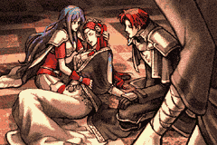
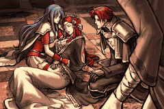

# Max Color Backgrounds

> [!NOTE]
> This feature was entirely developed by Huichelaar, I take no credit for it.
> This document exists to provide basic Q/A for common things that can go wrong as well steps you can take to make your backgrounds look better.

  
  

---

## 📑 Index
- [Introduction](#introduction)
- [Plan](#plan)
- [Code Locations](#code-locations)
- [QA](#QA)

---

## 🧩 Introduction

``CONFIG_MAX_COLOR_BACKGROUNDS``

This featured was developed to support the use of all available palette banks the GBA has access to. By default, users are limited to 16 colors,
which can create horrible banding issues when trying to port in more complex backgrounds. With this, users are provided with the option to use
either 224 color backgrounds (if they want to layer portraits and speaking textboxes on top) or 256 color backgrounds (if just using the regular
CG textboxes, like the ending credit scene with Lyon/Ephraim/Eirika).

Backgrounds usually require three things:
  - An image file
  - A palette file
  - A TSA file (Tile Screen Arrangement) - These are used to position the tiles of an image and tell each tile what palette color to use.
  
With this feature, we can also skip the requirement for TSA files (which are annoying hellspawn with no widely used tool outside of FEBuilder that can produce them).

---

## 🛠️ Plan

The BG table has been repointed in order to add new backgrounds (which can also be used for CGs).
The original CG table has been left along since the BG one serves both purposes.

Details regarding the exact usage for new backgrounds can be found in Huichelaar's [`README`](../../Kernel/Wizardry/Misc/Backgrounds_224_256_Colors/README.md)

Things to keep in mind:
  - Your backgrounds need to be processed with a special script that is not included in this buildfile for storage reasons.
    So you will need to download the folder again from here https://github.com/Huichelaar/FE8U_256ColCG
  - Understand that new backgrounds start from 0x38 as the original pointers have been copied over.

---

## 🗂️ Code Locations

| Feature | Location | Description |
|--------|----------|-------------|
| **BG Storage Folder** | [`gfx/BG`](../../Kernel/Wizardry/Misc/Backgrounds_224_256_Colors/gfx/BG/) | This is where the compressed images and palettes go |
| **BG Insertion**  |  [`gfx/BG/BG.event`](../../Kernel/Wizardry/Misc/Backgrounds_224_256_Colors/gfx/BG/BG.event) | This is the insertion point for your new backgrounds |

---

## 🐛 Q/A

> [!TIP]
> Why is my image messed up?

This could be for one of several reasons, ensure that:
- Your background is set to ``WORD 0x1`` in [`gfx/BG/BG.event`](../../Kernel/Wizardry/Misc/Backgrounds_224_256_Colors/gfx/BG/BG.event) if you're planning to have characters talk, or ``WORD 0x0`` otherwise
- Your background has 16px of right side padding so the dimensions are ``256x160`` instead of ``240x160`` (don't ask me why, GBA logic)
- The colors are under 256 (if using ``WORD 0x0``) or 224 (if using ``WORD 0x1``)

> [!TIP]
> My image looks blocky, can I improve it?

Yep, there's few ways to do this. Generally this happens because similar colors will get truncated (the GBA can only handle RGB values that are multiples of 8).
So you'll want to play with the hue and saturation of your image to get a better spread of colors and prevent the "blockiness" or color banding.

You can also resample your image using bilinear filtering to create a smoothed over effect. This generally works very well for pixelated artwork.

> [!TIP]
> The filesize on my image is really big, can I reduce it?

Yep, you'll want to ensure that your image is saved using ``indexed color mode`` rather than ``RGB color mode`` in your editing tool of choice (I generally use photoshop).
What I tend to do then is export the image with adaptive color filtering, which generally results in the image being reduced to 1/3 or less in size with no visible
loss in quality.

---
